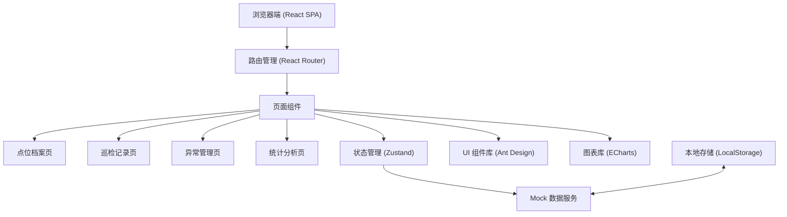
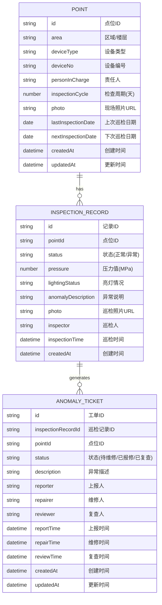

## 1. 架构设计



## 2. 技术描述

- **前端框架**：React@18 + TypeScript
- **构建工具**：Vite@5
- **UI 组件库**：Ant Design@5
- **路由管理**：React Router@6
- **状态管理**：Zustand
- **图表库**：ECharts@5
- **样式方案**：TailwindCSS@3 + CSS Modules
- **图标库**：@ant-design/icons
- **数据持久化**：LocalStorage + Mock 数据
- **初始化工具**：使用 vite 官方模板创建 React + TypeScript 项目

## 3. 路由定义

| 路由 | 页面 | 用途 |
|------|------|------|
| / | 点位档案页 | 消防设备点位列表、新增、编辑、删除 |
| /inspection | 巡检记录页 | 巡检记录列表、新增巡检填报 |
| /anomaly | 异常管理页 | 异常列表、状态流转、逾期红色列表 |
| /statistics | 统计分析页 | 楼层合格率、异常类型统计、未闭环问题 |

## 4. 数据模型

### 4.1 数据模型定义



### 4.2 TypeScript 类型定义

```typescript
// 点位档案
interface Point {
  id: string;
  area: string;
  deviceType: '灭火器' | '应急灯' | '安全出口贴纸';
  deviceNo: string;
  personInCharge: string;
  inspectionCycle: number;
  photo?: string;
  lastInspectionDate?: string;
  nextInspectionDate: string;
  createdAt: string;
  updatedAt: string;
}

// 巡检记录
interface InspectionRecord {
  id: string;
  pointId: string;
  status: 'normal' | 'anomaly';
  pressure?: number;
  lightingStatus?: '正常' | '不亮' | '闪烁';
  anomalyDescription?: string;
  photo?: string;
  inspector: string;
  inspectionTime: string;
  createdAt: string;
}

// 异常工单
interface AnomalyTicket {
  id: string;
  inspectionRecordId: string;
  pointId: string;
  status: 'pending' | 'reported' | 'reviewed';
  description: string;
  reporter: string;
  repairer?: string;
  reviewer?: string;
  reportTime: string;
  repairTime?: string;
  reviewTime?: string;
  createdAt: string;
  updatedAt: string;
}

// 统计数据
interface StatisticsData {
  floorPassRate: { floor: string; passRate: number; total: number; passed: number }[];
  anomalyByType: { type: string; count: number }[];
  openTicketsThisMonth: AnomalyTicket[];
  overduePoints: Point[];
}
```

### 4.3 Mock 数据初始化

```typescript
// 初始点位数据
const initialPoints: Point[] = [
  {
    id: '1',
    area: '1楼',
    deviceType: '灭火器',
    deviceNo: 'FMQ-001',
    personInCharge: '张三',
    inspectionCycle: 30,
    photo: 'https://trae-api-cn.mchost.guru/api/ide/v1/text_to_image?prompt=fire%20extinguisher%20in%20office%20building&image_size=square',
    nextInspectionDate: '2026-06-15',
    createdAt: '2026-01-01T00:00:00Z',
    updatedAt: '2026-01-01T00:00:00Z'
  },
  // ... 更多mock数据
];
```

## 5. 目录结构

```
src/
├── assets/              # 静态资源
├── components/          # 公共组件
│   ├── Layout/         # 布局组件
│   ├── PointForm.tsx   # 点位表单组件
│   ├── InspectionForm.tsx # 巡检表单组件
│   └── StatusBadge.tsx # 状态标签组件
├── pages/              # 页面组件
│   ├── PointPage.tsx
│   ├── InspectionPage.tsx
│   ├── AnomalyPage.tsx
│   └── StatisticsPage.tsx
├── store/              # 状态管理
│   └── useStore.ts
├── types/              # TypeScript 类型定义
│   └── index.ts
├── utils/              # 工具函数
│   ├── mock.ts         # Mock数据
│   └── helpers.ts      # 辅助函数
├── App.tsx
├── main.tsx
└── index.css
```

## 6. 核心模块设计

### 6.1 状态管理 (Zustand)
- 管理点位数据、巡检记录、异常工单
- 提供增删改查方法
- 集成 LocalStorage 持久化

### 6.2 逾期判断逻辑
```typescript
const isOverdue = (point: Point) => {
  const today = new Date();
  const nextDate = new Date(point.nextInspectionDate);
  return today > nextDate;
};
```

### 6.3 统计计算逻辑
- 楼层合格率：按区域分组，计算正常巡检数/总巡检数
- 异常类型统计：按设备类型统计异常次数
- 未闭环问题：筛选本月创建且状态非"已复查"的工单
