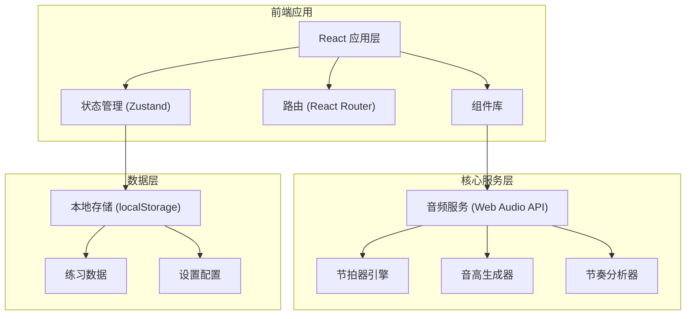
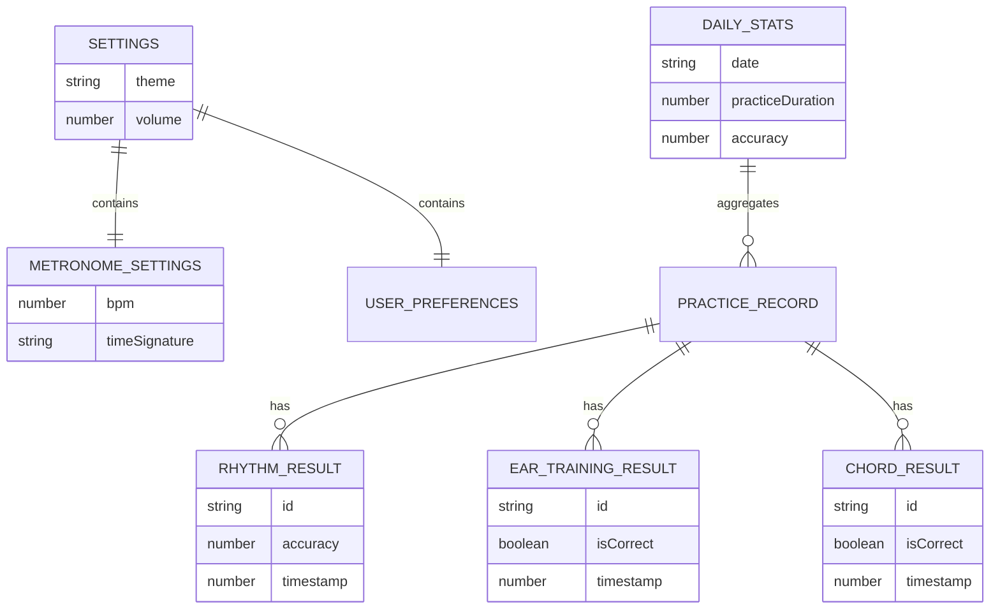

## 1. 架构设计



## 2. 技术描述

- **前端**: React@18 + TypeScript + Vite
- **样式**: Tailwind CSS 3
- **状态管理**: Zustand
- **路由**: React Router DOM
- **图表**: Recharts (折线图)
- **图标**: Lucide React
- **音频**: Web Audio API (原生，无外部依赖)
- **数据存储**: localStorage (本地存储练习记录)
- **初始化工具**: vite-init

## 3. 路由定义

| 路由 | 页面 | 用途 |
|------|------|------|
| / | 首页/节拍器 | 默认页面，节拍器功能 |
| /rhythm | 节奏训练 | 节奏跟打训练模式 |
| /ear-training | 听音训练 | 音高识别训练 |
| /chord-training | 和弦识别 | 和弦类型识别训练 |
| /statistics | 进度统计 | 练习数据统计和图表展示 |

## 4. 核心模块与类型定义

### 4.1 节拍器类型
```typescript
interface MetronomeSettings {
  bpm: number;
  timeSignature: '2/4' | '3/4' | '4/4' | '6/8';
  isPlaying: boolean;
  currentBeat: number;
  volume: number;
}
```

### 4.2 节奏训练类型
```typescript
interface RhythmPattern {
  id: string;
  name: string;
  beats: Array<{
    time: number;
    duration: 'whole' | 'half' | 'quarter' | 'eighth' | 'sixteenth';
    isAccented?: boolean;
  }>;
}

interface RhythmResult {
  patternId: string;
  hits: Array<{
    expectedTime: number;
    actualTime: number;
    deviation: number;
    isCorrect: boolean;
  }>;
  accuracy: number;
  timestamp: number;
}
```

### 4.3 听音训练类型
```typescript
type EarTrainingDifficulty = 'single' | 'double' | 'interval' | 'triad' | 'seventh';

interface EarTrainingQuestion {
  id: string;
  difficulty: EarTrainingDifficulty;
  notes: number[]; // MIDI 音高编号
}

interface EarTrainingResult {
  questionId: string;
  userAnswer: number[];
  isCorrect: boolean;
  timestamp: number;
}
```

### 4.4 和弦识别类型
```typescript
type ChordType = 'major' | 'minor' | 'diminished' | 'augmented';

interface ChordQuestion {
  id: string;
  rootNote: number;
  chordType: ChordType;
}

interface ChordResult {
  questionId: string;
  userAnswer: ChordType;
  correctAnswer: ChordType;
  isCorrect: boolean;
  timestamp: number;
}
```

### 4.5 统计数据类型
```typescript
interface DailyStats {
  date: string;
  practiceDuration: number; // 秒
  totalQuestions: number;
  correctAnswers: number;
  accuracy: number;
  rhythmAccuracy: number;
  earAccuracy: number;
  chordAccuracy: number;
}

interface Statistics {
  dailyStats: DailyStats[];
  totalPracticeTime: number;
  overallAccuracy: number;
}
```

## 5. 数据模型

### 5.1 数据模型关系


### 5.2 本地存储结构
所有数据存储于 localStorage 中，使用以下键名：
- `music_trainer_settings`: 用户设置
- `music_trainer_records`: 练习记录
- `music_trainer_daily_stats`: 每日统计数据

## 6. 项目结构
```
src/
├── components/          # 可复用组件
│   ├── layout/         # 布局组件 (导航、页脚等)
│   ├── metronome/      # 节拍器相关组件
│   ├── rhythm/         # 节奏训练组件
│   ├── ear-training/   # 听音训练组件
│   ├── chord-training/ # 和弦识别组件
│   ├── piano/          # 虚拟钢琴组件
│   └── ui/             # 通用 UI 组件
├── hooks/              # 自定义 React hooks
│   ├── useMetronome.ts
│   ├── useAudio.ts
│   └── useStatistics.ts
├── pages/              # 页面组件
│   ├── Home.tsx
│   ├── RhythmTraining.tsx
│   ├── EarTraining.tsx
│   ├── ChordTraining.tsx
│   └── Statistics.tsx
├── store/              # Zustand 状态管理
│   └── useAppStore.ts
├── utils/              # 工具函数
│   ├── audio.ts        # 音频相关工具
│   ├── musicTheory.ts  # 乐理相关计算
│   └── storage.ts      # 本地存储工具
├── types/              # TypeScript 类型定义
│   └── index.ts
├── data/               # 静态数据
│   ├── rhythms.ts      # 预设节奏型
│   └── chords.ts       # 和弦数据
├── App.tsx
├── main.tsx
└── index.css
```
