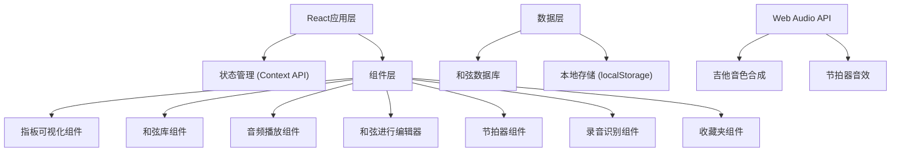

## 1. 架构设计



## 2. 技术描述

- **前端框架**: React@18 + TypeScript
- **构建工具**: Vite@5
- **样式方案**: TailwindCSS@3 + CSS Modules
- **状态管理**: React Context API + useReducer
- **音频处理**: Web Audio API (原生)
- **拖拽功能**: @dnd-kit/core
- **图标**: lucide-react
- **数据存储**: localStorage (收藏夹数据)

## 3. 路由定义

| 路由路径 | 页面名称 | 功能描述 |
|---------|---------|---------|
| / | 和弦速查 | 吉他指板展示 + 和弦库浏览 |
| /practice | 听音练习 | 和弦播放 + 听音训练 |
| /progression | 和弦进行 | 拖拽编辑 + 节拍器播放 |
| /recognition | 录音识别 | 上传录音 + Mock识别 |
| /favorites | 收藏夹 | 收藏管理 + 分类浏览 |

## 4. 数据模型

### 4.1 和弦数据模型

```typescript
interface Chord {
  id: string;
  name: string;
  rootNote: string;
  type: 'major' | 'minor' | '7' | 'maj7' | 'm7' | 'dim' | 'aug' | 'sus2' | 'sus4';
  frets: number[];
  fingers: number[];
  baseFret: number;
  barres?: { fret: number; fromString: number; toString: number }[];
}
```

### 4.2 和弦进行数据模型

```typescript
interface ChordProgression {
  id: string;
  name: string;
  category: string;
  chords: string[];
  bpm: number;
  beatsPerMeasure: number;
  createdAt: number;
}
```

### 4.3 收藏数据模型

```typescript
interface Favorite {
  id: string;
  type: 'chord' | 'progression';
  itemId: string;
  createdAt: number;
}
```

## 5. 核心模块设计

### 5.1 音频引擎模块 (WebAudio)
- 吉他音色合成：使用振荡器+滤波器模拟吉他音色
- 包络控制：ADSR包络模拟吉他拨弦
- 扫弦效果：按时间间隔依次触发各弦
- 节拍器：精准定时的短脉冲音

### 5.2 指板可视化模块
- SVG绘制吉他指板
- 动态渲染和弦按法
- 手指位置、空弦、不弹标识
- 响应式尺寸适配

### 5.3 和弦进行编辑器
- 拖拽排序和弦
- 时间轴布局
- 与节拍器同步播放
- 循环播放控制

## 6. 目录结构

```
src/
├── components/
│   ├── Fretboard/          # 吉他指板组件
│   ├── ChordLibrary/       # 和弦库组件
│   ├── AudioPlayer/        # 音频播放组件
│   ├── ProgressionEditor/  # 和弦进行编辑器
│   ├── Metronome/          # 节拍器组件
│   ├── Recorder/           # 录音识别组件
│   └── Favorites/          # 收藏夹组件
├── data/
│   └── chords.ts           # 和弦数据库
├── hooks/
│   ├── useAudio.ts         # 音频Hook
│   ├── useMetronome.ts     # 节拍器Hook
│   └── useLocalStorage.ts  # 本地存储Hook
├── context/
│   └── AppContext.tsx      # 全局状态
├── pages/
│   ├── ChordLookup.tsx
│   ├── Practice.tsx
│   ├── Progression.tsx
│   ├── Recognition.tsx
│   └── Favorites.tsx
├── types/
│   └── index.ts            # 类型定义
└── utils/
    └── audio.ts            # 音频工具函数
```
