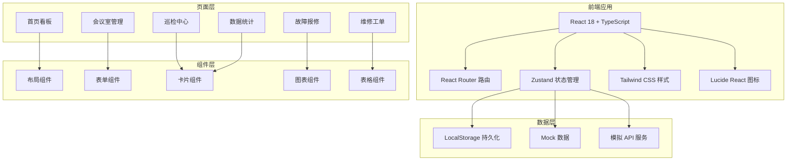
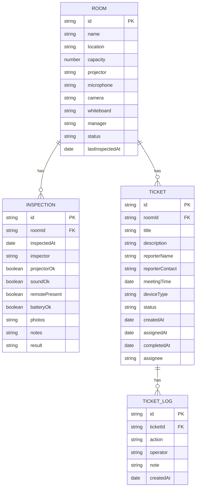

## 1. 架构设计



## 2. 技术选型

- **前端框架**: React 18 + TypeScript
- **构建工具**: Vite 5
- **路由**: react-router-dom 6
- **状态管理**: zustand 4
- **样式**: Tailwind CSS 3
- **图标**: lucide-react
- **图表**: Recharts（轻量级 React 图表库）
- **数据持久化**: LocalStorage
- **后端**: 无后端，纯前端 Mock 数据

## 3. 路由定义

| 路由路径 | 页面名称 | 说明 |
|----------|----------|------|
| / | 首页看板 | 会议室状态总览 |
| /rooms | 会议室管理 | 会议室 CRUD |
| /inspection | 巡检中心 | 设备巡检和历史 |
| /report | 故障报修 | 员工提交报修 |
| /tickets | 维修工单 | 工单管理看板 |
| /stats | 数据统计 | 报表和图表 |

## 4. 数据模型

### 4.1 ER 图



### 4.2 状态枚举

**会议室状态 (RoomStatus)**:
- `normal` - 正常
- `repairing` - 待维修
- `missing_parts` - 缺配件
- `not_inspected` - 今日未巡检

**工单状态 (TicketStatus)**:
- `pending` - 待派单
- `assigned` - 已派单
- `processing` - 处理中
- `completed` - 已修好

**设备类型 (DeviceType)**:
- `projector` - 投屏设备
- `sound` - 音响/麦克风
- `remote` - 遥控器
- `camera` - 摄像头
- `whiteboard` - 白板
- `other` - 其他

## 5. 项目结构

```
src/
├── components/          # 通用组件
│   ├── layout/         # 布局组件
│   ├── ui/             # 基础 UI 组件
│   └── charts/         # 图表组件
├── pages/              # 页面组件
│   ├── Dashboard.tsx
│   ├── Rooms.tsx
│   ├── Inspection.tsx
│   ├── Report.tsx
│   ├── Tickets.tsx
│   └── Stats.tsx
├── store/              # Zustand store
│   └── useStore.ts
├── types/              # TypeScript 类型
│   └── index.ts
├── utils/              # 工具函数
│   ├── mock.ts         # Mock 数据
│   └── helpers.ts
├── App.tsx
├── main.tsx
└── index.css
```

## 6. 核心功能实现方案

### 6.1 状态管理
使用 Zustand 管理全局状态，包括会议室列表、巡检记录、工单列表。通过 localStorage 中间件实现数据持久化。

### 6.2 首页看板
四列卡片布局，每列展示对应状态的会议室列表。支持点击卡片查看详情和快捷操作。

### 6.3 巡检功能
表单式巡检清单，包含复选框组、照片上传（使用 FileReader 转 base64 存储）、备注文本域。提交后自动更新会议室状态。

### 6.4 工单看板
三列拖拽式看板（待派单/处理中/已修好），支持状态流转。每个工单卡片显示关键信息和操作按钮。

### 6.5 数据统计
使用 Recharts 库实现三种图表：
- 柱状图：会议室故障率排行
- 折线图：平均修复时长趋势
- 环形图：设备问题类型分布
