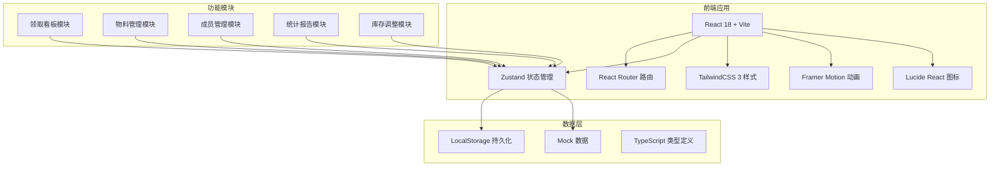
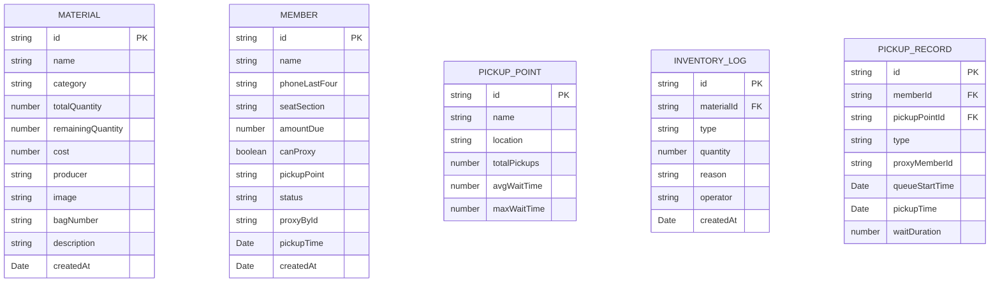

## 1. 架构设计



## 2. 技术描述

- **前端框架**: React@18 + TypeScript
- **构建工具**: Vite@5
- **路由管理**: React Router DOM@6
- **状态管理**: Zustand@4（轻量级，支持持久化）
- **样式方案**: TailwindCSS@3
- **动画库**: Framer Motion@11
- **图标库**: Lucide React
- **数据持久化**: LocalStorage + Zustand persist
- **数据模拟**: 内置 Mock 数据，无需后端

## 3. 路由定义

| 路由路径 | 页面名称 | 功能描述 |
|----------|----------|----------|
| / | 领取看板 | 三列布局展示待领取、已领取、代领状态 |
| /materials | 物料管理 | 物料列表、新增、编辑、库存查看 |
| /members | 成员管理 | 成员名单、新增、编辑、代领设置 |
| /reports | 统计报告 | 未领取名单、费用分摊、剩余物料、排队分析 |

## 4. 数据模型

### 4.1 数据模型定义



### 4.2 类型定义

```typescript
// 物料类型
interface Material {
  id: string;
  name: string;
  category: 'slogan' | 'lightSticker' | 'ticketHolder' | 'badge';
  totalQuantity: number;
  remainingQuantity: number;
  cost: number;
  producer: string;
  image: string;
  bagNumber: string;
  description: string;
  createdAt: string;
}

// 成员类型
interface Member {
  id: string;
  name: string;
  phoneLastFour: string;
  seatSection: string;
  amountDue: number;
  canProxy: boolean;
  pickupPoint: string;
  status: 'pending' | 'picked' | 'proxied';
  proxyById: string | null;
  pickupTime: string | null;
  queueStartTime: string | null;
  createdAt: string;
}

// 取货点类型
interface PickupPoint {
  id: string;
  name: string;
  location: string;
}

// 库存日志类型
interface InventoryLog {
  id: string;
  materialId: string;
  type: 'reissue' | 'damaged' | 'missing';
  quantity: number;
  reason: string;
  operator: string;
  createdAt: string;
}

// 领取记录类型
interface PickupRecord {
  id: string;
  memberId: string;
  pickupPointId: string;
  type: 'self' | 'proxy';
  proxyMemberId: string | null;
  queueStartTime: string;
  pickupTime: string;
  waitDuration: number;
}

// 统计数据类型
interface ReportData {
  totalMembers: number;
  pickedCount: number;
  pendingCount: number;
  proxiedCount: number;
  totalCost: number;
  avgCostPerPerson: number;
  materials: Material[];
  unpickedMembers: Member[];
  pickupPointStats: {
    id: string;
    name: string;
    totalPickups: number;
    avgWaitTime: number;
    maxWaitTime: number;
  }[];
}
```

## 5. 状态管理设计

### 5.1 Store 分层

```typescript
// useMaterialStore - 物料状态
- materials: Material[]
- addMaterial()
- updateMaterial()
- deleteMaterial()
- adjustInventory()
- getMaterialById()

// useMemberStore - 成员状态
- members: Member[]
- addMember()
- updateMember()
- deleteMember()
- confirmPickup()
- confirmProxyPickup()
- getMembersByStatus()
- getMembersByPickupPoint()

// usePickupPointStore - 取货点状态
- pickupPoints: PickupPoint[]
- currentPickupPoint: string
- setCurrentPickupPoint()
- addPickupPoint()

// useReportStore - 统计报告
- generateReport()
- getUnpickedMembers()
- getCostSharing()
- getRemainingMaterials()
- getQueueAnalysis()
```

## 6. 组件设计

### 6.1 通用组件
- `Button` - 按钮组件（支持主色/次色/渐变等样式）
- `Card` - 卡片组件（玻璃拟态效果）
- `Modal` - 弹窗组件
- `Input` - 输入框组件
- `Tag` - 标签组件
- `Avatar` - 头像组件
- `StatCard` - 统计数字卡片
- `EmptyState` - 空状态

### 6.2 页面组件
- `KanbanBoard` - 领取看板主页面
  - `KanbanColumn` - 看板列
  - `MemberCard` - 成员卡片
  - `PickupPointTabs` - 取货点标签
  - `SearchBar` - 搜索栏
- `MaterialPage` - 物料管理页
  - `MaterialGrid` - 物料网格
  - `MaterialCard` - 物料卡片
  - `MaterialForm` - 物料表单
- `MemberPage` - 成员管理页
  - `MemberTable` - 成员表格
  - `MemberForm` - 成员表单
- `ReportPage` - 统计报告页
  - `UnpickedList` - 未领取名单
  - `CostSharing` - 费用分摊
  - `RemainingMaterials` - 剩余物料
  - `QueueAnalysis` - 排队分析

### 6.3 功能组件
- `PickupModal` - 领取确认弹窗
- `ProxyPicker` - 代领人选择器
- `InventoryAdjustModal` - 库存调整弹窗
- `QRScanner` - 扫码模拟组件
```

## 7. 开发规范

- **代码风格**: ESLint + Prettier
- **命名规范**: 组件 PascalCase，变量 camelCase，常量 UPPER_SNAKE_CASE
- **文件组织**: 按功能模块分组，组件目录含 index.ts 导出
- **样式方案**: TailwindCSS 优先，复杂样式使用 CSS Modules
- **动画规范**: 使用 Framer Motion 的 motion 组件，避免直接操作 DOM
- **类型安全**: 全面使用 TypeScript，禁止 any 类型
- **状态更新**: 不可变数据，使用 Zustand 的 set 方法
- **持久化**: 关键状态自动持久化到 LocalStorage
