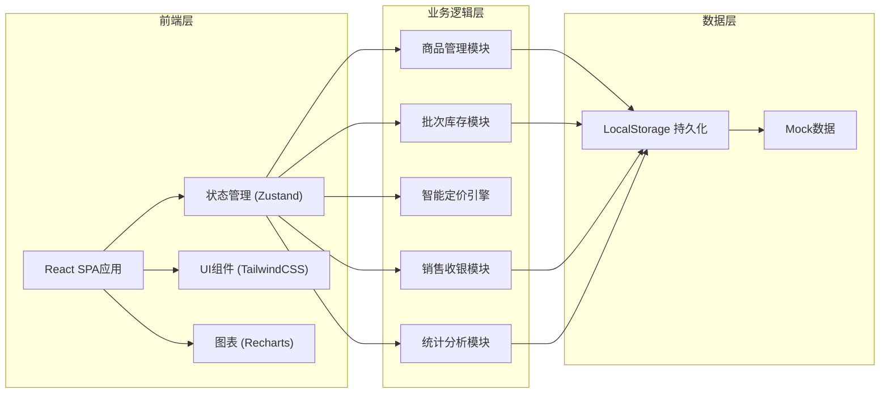
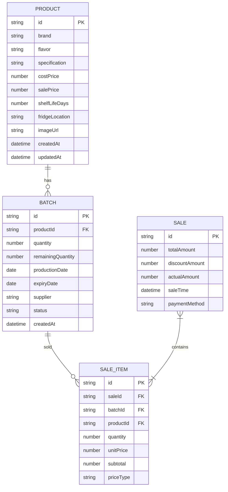

## 1. 架构设计



## 2. 技术描述

- **前端框架**：React@18 + TypeScript
- **构建工具**：Vite@5
- **样式方案**：TailwindCSS@3
- **状态管理**：Zustand（轻量级状态管理）
- **路由方案**：React Router@6
- **图表库**：Recharts
- **图标库**：Lucide React
- **数据持久化**：LocalStorage
- **日期处理**：date-fns
- **后端**：无（纯前端应用，数据存储在LocalStorage）

## 3. 路由定义

| 路由路径 | 页面名称 | 功能说明 |
|----------|----------|----------|
| /dashboard | 仪表盘首页 | 数据概览、临期预警、快捷操作 |
| /products | 商品档案 | 商品列表、新增/编辑商品 |
| /inventory | 批次库存 | 批次列表、入库操作 |
| /pos | 收银台 | 商品销售、购物车、结算 |
| /stats | 统计报表 | 临期统计、促销效果、报损分析、热销排行、进货建议 |

## 4. 数据模型

### 4.1 实体关系图



### 4.2 数据类型定义

```typescript
// 商品档案
interface Product {
  id: string;
  brand: string;
  flavor: string;
  specification: string;
  costPrice: number;
  salePrice: number;
  shelfLifeDays: number;
  fridgeLocation: string;
  imageUrl: string;
  createdAt: string;
  updatedAt: string;
}

// 批次库存
type BatchStatus = 'normal' | 'near_expiry' | 'clearance' | 'expired' | 'sold_out';

interface Batch {
  id: string;
  productId: string;
  quantity: number;
  remainingQuantity: number;
  productionDate: string;
  expiryDate: string;
  supplier: string;
  status: BatchStatus;
  createdAt: string;
}

// 销售记录
type PriceType = 'normal' | 'discount' | 'clearance';

interface Sale {
  id: string;
  totalAmount: number;
  discountAmount: number;
  actualAmount: number;
  saleTime: string;
  paymentMethod: string;
  items: SaleItem[];
}

interface SaleItem {
  id: string;
  saleId: string;
  batchId: string;
  productId: string;
  quantity: number;
  unitPrice: number;
  subtotal: number;
  priceType: PriceType;
}
```

### 4.3 状态计算规则

- **normal（正常）**：距到期日 > 3 天
- **near_expiry（临期折扣）**：1天 < 距到期日 ≤ 3天，建议折扣价 = 原价 × 0.7
- **clearance（清仓甩卖）**：距到期日 ≤ 1天，清仓价 = 原价 × 0.4
- **expired（过期报损）**：已超过到期日，自动下架
- **sold_out（售罄）**：批次库存为0

### 4.4 先进先出（FIFO）规则
销售时按到期日从早到晚排序，优先扣减最早到期的批次库存，直到满足购买数量或所有批次扣减完毕。

## 5. 目录结构

```
src/
├── components/          # 通用组件
│   ├── Layout/         # 布局组件
│   ├── Card/           # 卡片组件
│   ├── Modal/          # 弹窗组件
│   └── Table/          # 表格组件
├── pages/              # 页面组件
│   ├── Dashboard/      # 仪表盘
│   ├── Products/       # 商品档案
│   ├── Inventory/      # 批次库存
│   ├── POS/            # 收银台
│   └── Stats/          # 统计报表
├── store/              # 状态管理
│   ├── productStore.ts
│   ├── inventoryStore.ts
│   ├── saleStore.ts
│   └── index.ts
├── utils/              # 工具函数
│   ├── dateUtils.ts
│   ├── priceUtils.ts
│   ├── fifoUtils.ts
│   └── storage.ts
├── types/              # TypeScript类型
│   └── index.ts
├── data/               # Mock数据
│   └── mockData.ts
├── App.tsx
├── main.tsx
└── index.css
```
