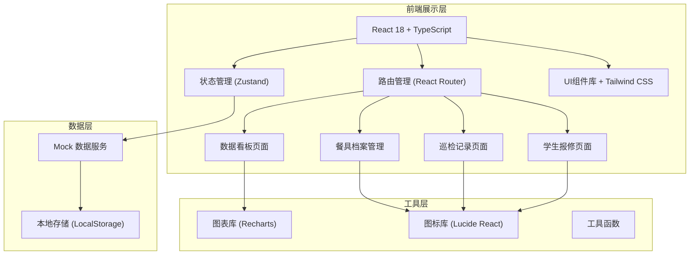
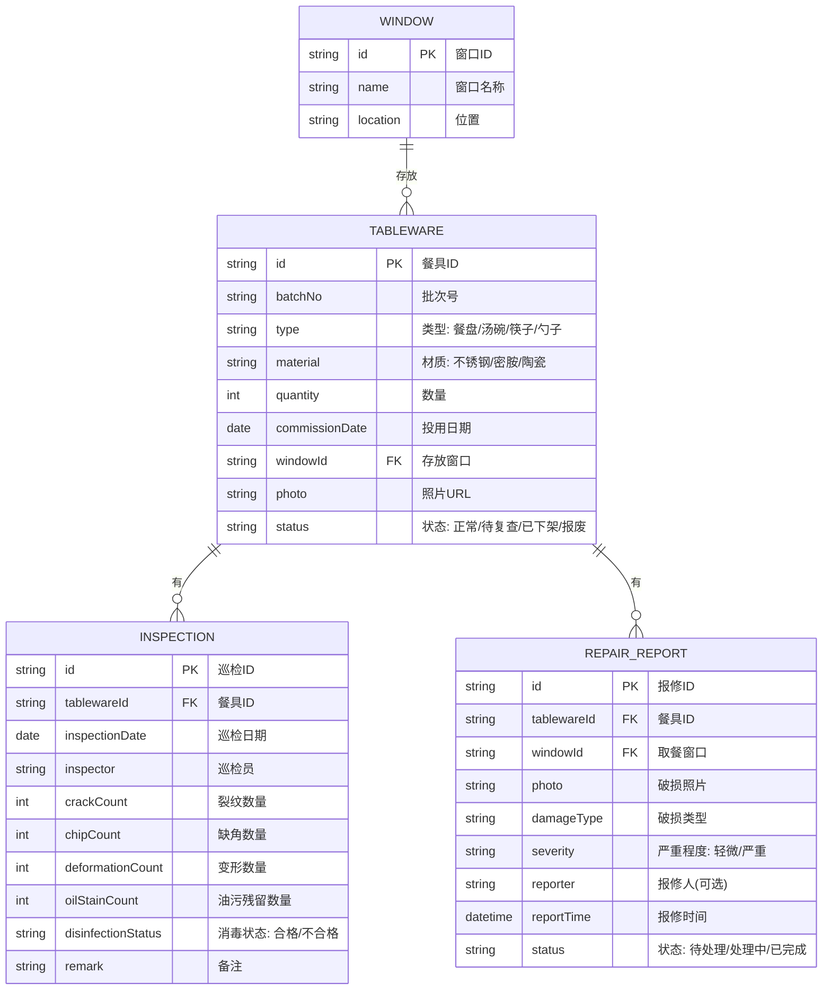

## 1. 架构设计



## 2. 技术选型

- **前端框架**: React 18 + TypeScript
- **构建工具**: Vite
- **样式方案**: Tailwind CSS 3
- **路由管理**: React Router DOM 6
- **状态管理**: Zustand
- **图表库**: Recharts
- **图标库**: Lucide React
- **数据持久化**: LocalStorage + Mock 数据
- **后端**: 无后端，纯前端 Mock 实现

## 3. 路由定义

| 路由路径 | 页面名称 | 说明 |
|----------|----------|------|
| `/` | 数据看板 | 首页，展示统计数据和图表 |
| `/tableware` | 餐具档案 | 餐具列表、新增、编辑、详情 |
| `/inspection` | 巡检记录 | 巡检列表、新建巡检 |
| `/report` | 学生报修 | 扫码报修表单、提交成功页 |

## 4. 数据模型

### 4.1 实体关系图



### 4.2 数据结构定义

```typescript
// 餐具类型
type TablewareType = 'plate' | 'bowl' | 'chopsticks' | 'spoon';

// 材质类型
type MaterialType = 'stainless' | 'melamine' | 'ceramic';

// 餐具状态
type TablewareStatus = 'normal' | 'pending_review' | 'off_shelf' | 'scrapped';

// 破损严重程度
type SeverityLevel = 'minor' | 'moderate' | 'severe';

// 报修状态
type ReportStatus = 'pending' | 'processing' | 'completed';

// 消毒状态
type DisinfectionStatus = 'qualified' | 'unqualified';

interface Window {
  id: string;
  name: string;
  location: string;
}

interface Tableware {
  id: string;
  batchNo: string;
  type: TablewareType;
  material: MaterialType;
  quantity: number;
  commissionDate: string;
  windowId: string;
  photo: string;
  status: TablewareStatus;
  damagedCount: number;
  scrappedCount: number;
}

interface InspectionRecord {
  id: string;
  tablewareId: string;
  tablewareBatchNo: string;
  inspectionDate: string;
  inspector: string;
  crackCount: number;
  chipCount: number;
  deformationCount: number;
  oilStainCount: number;
  disinfectionStatus: DisinfectionStatus;
  remark: string;
}

interface RepairReport {
  id: string;
  tablewareId: string;
  tablewareBatchNo: string;
  windowId: string;
  windowName: string;
  photo: string;
  damageType: string;
  severity: SeverityLevel;
  reporter?: string;
  reportTime: string;
  status: ReportStatus;
  remark?: string;
}
```

## 5. 目录结构

```
src/
├── components/          # 公共组件
│   ├── Layout/          # 布局组件
│   ├── StatCard/        # 统计卡片
│   ├── StatusBadge/     # 状态标签
│   └── Modal/           # 弹窗组件
├── pages/               # 页面组件
│   ├── Dashboard/       # 数据看板
│   ├── Tableware/       # 餐具档案
│   ├── Inspection/      # 巡检记录
│   └── Report/          # 学生报修
├── store/               # 状态管理 (Zustand)
│   ├── useTablewareStore.ts
│   ├── useInspectionStore.ts
│   └── useReportStore.ts
├── data/                # Mock 数据
│   └── mockData.ts
├── utils/               # 工具函数
│   ├── format.ts
│   └── constants.ts
├── types/               # 类型定义
│   └── index.ts
├── App.tsx
├── main.tsx
└── index.css
```

## 6. 功能模块清单

### 6.1 数据看板
- 统计卡片：待处理数、破损率、报废数、消毒异常、待采购
- 窗口破损率柱状图
- 破损类型分布饼图
- 待处理报修/巡检列表
- 数据联动更新

### 6.2 餐具档案管理
- 餐具列表展示（分页、搜索、筛选）
- 新增餐具档案
- 编辑餐具信息
- 查看批次详情
- 状态变更操作

### 6.3 巡检记录
- 巡检记录列表（按时间/批次/窗口筛选）
- 新建巡检记录
- 查看巡检详情
- 自动更新餐具状态

### 6.4 学生报修
- 破损照片上传
- 取餐窗口选择
- 破损类型选择
- 备注填写
- 提交成功反馈
- 自动分级处理

## 7. 开发规范

- 组件文件使用 `.tsx` 后缀
- 每个组件文件不超过 300 行
- 使用 TypeScript 类型定义
- 使用 Tailwind CSS 进行样式开发
- 状态管理使用 Zustand
- 图标使用 Lucide React
- 遵循响应式设计原则
- 代码遵循 ESLint/Prettier 规范
