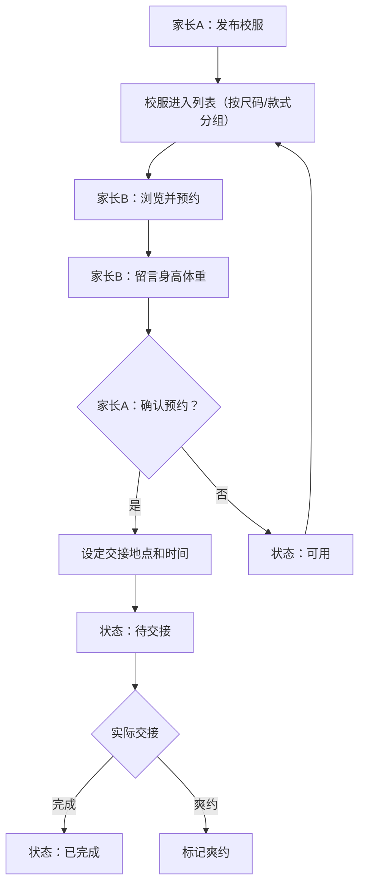

## 1. 产品概述

校服流转——班级校服尺码流转平台，让穿不下的校服在班级间流转给需要的家庭，减少浪费、节省开支。
- 解决孩子长得快、校服频繁更换导致的浪费问题，目标用户为小学生家长
- 通过班级内流转降低家庭校服开支，促进邻里互助，推动绿色可持续消费

## 2. 核心功能

### 2.1 用户角色

| 角色 | 注册方式 | 核心权限 |
|------|----------|----------|
| 家长用户 | 手机号注册 | 发布校服、预约领取、发布求购、查看统计 |

### 2.2 功能模块

1. **首页**：校服列表分组展示（按尺码/男女款/夏冬装），急需尺码置顶，筛选搜索
2. **发布页**：发布校服信息（学校、年级、尺码、季节、男女款、成色、污渍、价格/免费、照片）
3. **详情页**：校服详情展示、预约领取、留言身高体重、确认交接
4. **求购页**：发布和浏览求购需求（如"想找130码冬季外套"）
5. **我的页**：我发布的、我预约的、交接记录、爽约标记
6. **统计页**：本学期流转件数、节省金额、紧缺尺码排行

### 2.3 页面详情

| 页面名称 | 模块名称 | 功能描述 |
|----------|----------|----------|
| 首页 | 筛选栏 | 按尺码、男女款、夏装/冬装筛选，支持关键词搜索 |
| 首页 | 急需置顶区 | 显示紧缺尺码的校服，自动置顶展示 |
| 首页 | 校服卡片列表 | 分组展示校服信息卡片：照片缩略图、尺码、季节、成色、价格/免费标签 |
| 发布页 | 表单填写 | 填写学校、年级、尺码、季节、男女款、成色、是否有污渍、价格或免费、上传照片 |
| 详情页 | 校服信息展示 | 大图、完整信息、发布者信息 |
| 详情页 | 预约领取 | 填写孩子身高体重留言，提交预约申请 |
| 详情页 | 确认交接 | 发布者确认预约，填写交接地点和时间，状态变为待交接 |
| 求购页 | 求购列表 | 展示所有求购需求，可按尺码和季节筛选 |
| 求购页 | 发布求购 | 填写需要的尺码、季节、款式描述 |
| 我的页 | 我发布的 | 管理已发布的校服，查看预约情况 |
| 我的页 | 我预约的 | 查看预约状态，待确认/待交接/已完成 |
| 我的页 | 交接记录 | 历史交接记录，爽约标记管理 |
| 统计页 | 流转统计 | 本学期流转总件数、节省总金额 |
| 统计页 | 尺码紧缺排行 | 各尺码供需对比，标记最缺尺码 |
| 统计页 | 趋势图表 | 按月流转数量趋势 |

## 3. 核心流程

**发布→预约→确认→交接→完成**：家长发布穿不下的校服 → 其他家长浏览并预约（留言孩子身高体重）→ 发布者确认预约并设定交接地点时间 → 双方交接 → 确认完成。若预约方爽约则标记。

**求购流程**：家长发布求购需求（尺码+季节+描述）→ 有匹配校服的家长看到后联系 → 走正常发布预约流程。

## 4. 用户界面设计

### 4.1 设计风格

- 主色调：温暖的橙色 (#F97316) 代表关怀与温暖，辅助色为柔绿色 (#22C55E) 代表可持续
- 按钮风格：圆角胶囊按钮，带轻微阴影
- 字体：标题使用 Noto Sans SC Bold，正文使用 Noto Sans SC Regular
- 布局风格：卡片式布局，顶部标签导航
- 图标风格：使用 Lucide 图标，线条风格搭配柔和填充
- 整体风格：温暖、友好、亲子感，带手绘纹理点缀

### 4.2 页面设计概述

| 页面名称 | 模块名称 | UI元素 |
|----------|----------|--------|
| 首页 | 筛选栏 | 横向滚动标签组（尺码/男女款/季节），搜索框 |
| 首页 | 急需置顶区 | 橙色渐变背景横幅，脉冲动画提示紧缺 |
| 首页 | 校服卡片 | 圆角卡片，左图右文，免费标签绿色，付费标签橙色 |
| 发布页 | 表单 | 分步表单，下拉选择+输入框，照片上传区带虚线框 |
| 详情页 | 信息展示 | 大图轮播，信息标签组，预约按钮固定底部 |
| 求购页 | 需求卡片 | 紧凑卡片列表，尺码和季节标签醒目 |
| 我的页 | 标签切换 | 顶部Tab切换（发布/预约/交接），列表项带状态标签 |
| 统计页 | 数据卡片 | 大数字展示，环形图、柱状图，渐变背景 |

### 4.3 响应式设计

- 桌面优先设计，最大宽度 1280px 居中
- 平板：两列卡片布局
- 手机：单列卡片，底部固定导航栏
- 触摸优化：按钮最小 44px 触摸区域

### 4.4 动效设计

- 页面切换：淡入淡出 + 轻微上滑
- 卡片悬停：轻微上浮 + 阴影加深
- 状态变更：标签颜色过渡动画
- 急需置顶：微弱脉冲呼吸动画
- 数字统计：数字递增动画
