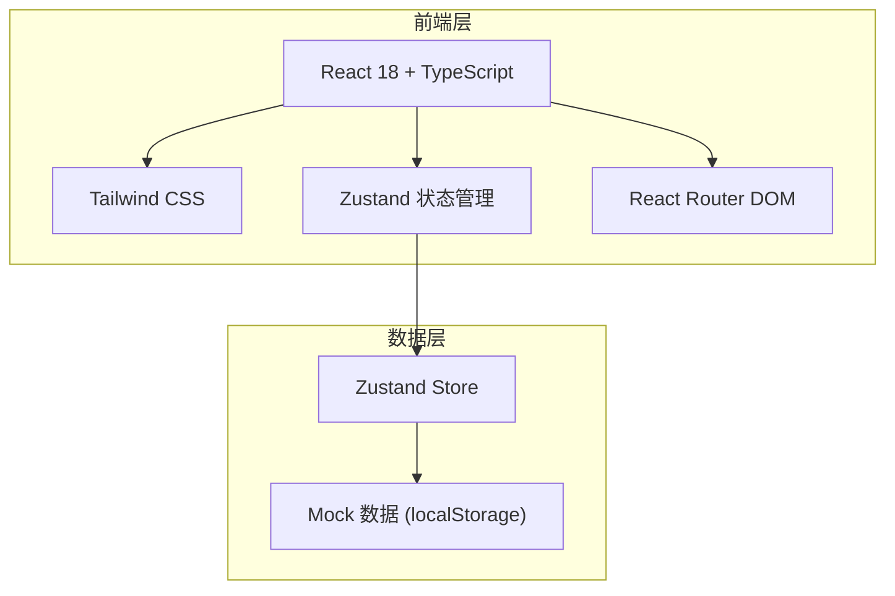
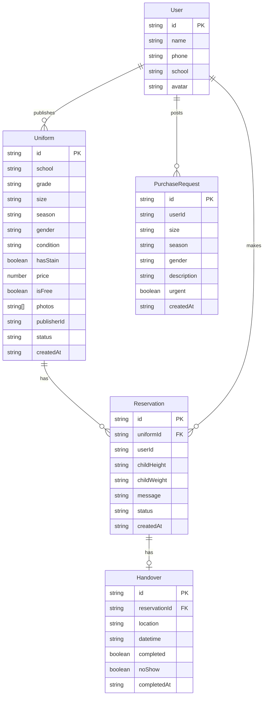

## 1. 架构设计

## 2. 技术说明

- 前端：React@18 + TypeScript + Tailwind CSS@3 + Vite
- 初始化工具：vite-init
- 后端：无（纯前端项目，使用 localStorage 持久化 mock 数据）
- 数据库：localStorage + Zustand 状态管理
- 图表：自定义 SVG 图表实现统计可视化

## 3. 路由定义

| 路由 | 用途 |
|------|------|
| / | 首页：校服列表分组展示，筛选搜索 |
| /publish | 发布校服页面 |
| /uniform/:id | 校服详情页 |
| /requests | 求购需求列表页 |
| /requests/publish | 发布求购需求 |
| /profile | 我的页面 |
| /stats | 统计页面 |

## 4. 数据模型

### 4.1 数据模型定义

### 4.2 数据定义

**Uniform（校服）**：

| 字段 | 类型 | 说明 |
|------|------|------|
| id | string | UUID |
| school | string | 学校名称 |
| grade | string | 年级（一年级~六年级） |
| size | string | 尺码（110/120/130/140/150/160/165） |
| season | string | 季节（夏装/冬装/春秋） |
| gender | string | 男女款（男款/女款/通用） |
| condition | string | 成色（全新/九成新/八成新/七成新） |
| hasStain | boolean | 是否有污渍 |
| stainDesc | string | 污渍描述（可选） |
| price | number | 价格（0表示免费） |
| isFree | boolean | 是否免费赠送 |
| photos | string[] | 照片URL列表 |
| publisherId | string | 发布者ID |
| status | string | 状态：available/reserved/pending_handover/completed |
| isUrgent | boolean | 是否急需（紧缺尺码自动标记） |
| createdAt | string | 发布时间 |

**Reservation（预约）**：

| 字段 | 类型 | 说明 |
|------|------|------|
| id | string | UUID |
| uniformId | string | 校服ID |
| userId | string | 预约者ID |
| childHeight | string | 孩子身高 |
| childWeight | string | 孩子体重 |
| message | string | 留言 |
| status | string | 状态：pending/confirmed/rejected/completed/no_show |
| createdAt | string | 预约时间 |

**Handover（交接）**：

| 字段 | 类型 | 说明 |
|------|------|------|
| id | string | UUID |
| reservationId | string | 预约ID |
| location | string | 交接地点 |
| datetime | string | 交接时间 |
| completed | boolean | 是否完成 |
| noShow | boolean | 是否爽约 |
| completedAt | string | 完成时间 |

**PurchaseRequest（求购需求）**：

| 字段 | 类型 | 说明 |
|------|------|------|
| id | string | UUID |
| userId | string | 求购者ID |
| size | string | 需要的尺码 |
| season | string | 需要的季节 |
| gender | string | 男女款 |
| description | string | 描述（如"想找130码冬季外套"） |
| urgent | boolean | 是否紧急 |
| status | string | 状态：open/matched/closed |
| createdAt | string | 发布时间 |

**User（用户）**：

| 字段 | 类型 | 说明 |
|------|------|------|
| id | string | UUID |
| name | string | 昵称 |
| phone | string | 手机号 |
| school | string | 所在学校 |
| avatar | string | 头像URL |
