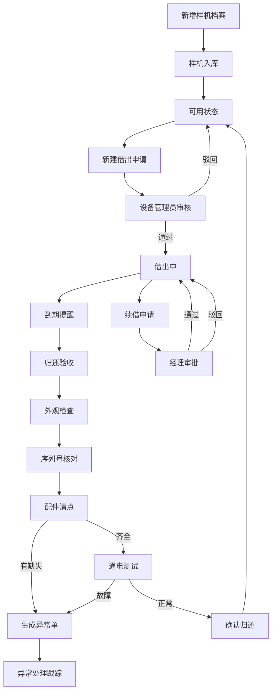

## 1. 产品概述

样机管理系统是一款面向企业商务和设备管理团队的样机全生命周期管理工具，解决样机借出跟踪难、归还核对繁、配件丢失追责难等痛点。通过标准化的借出-归还流程、醒目的到期逾期提醒、以及多维度的数据统计，帮助企业提升样机周转效率，降低资产损失。

- **目标用户**：商务人员、设备管理员、部门经理
- **核心价值**：样机去向可追溯、归还流程标准化、异常问题即时发现、数据驱动管理决策

## 2. 核心功能

### 2.1 用户角色

| 角色 | 核心权限 |
|------|----------|
| 商务人员 | 新建借出申请、提交归还申请、申请续借、查看自己负责的样机 |
| 设备管理员 | 样机档案管理、审核借出/续借、执行归还验收、异常处理、查看统计 |
| 部门经理 | 查看所有样机状态、统计分析报表、审批续借 |

### 2.2 功能模块

1. **仪表盘**：概览统计、到期/逾期提醒、快捷操作入口
2. **样机管理**：样机档案、配件清单、状态跟踪
3. **借出管理**：借出登记、客户信息、押金管理、负责人分配
4. **归还管理**：分步验收（外观→序列号→配件→通电测试）、异常生成
5. **续借管理**：续借申请、审批记录、历史追溯
6. **异常管理**：配件缺失、损坏记录、处理跟踪
7. **统计分析**：客户逾期排行、样机周转率、损坏类型分布

### 2.3 页面详情

| 页面名称 | 模块名称 | 功能描述 |
|---------|---------|---------|
| 仪表盘 | 数据概览 | 在借数量、今日到期、逾期数量、本月归还等关键指标卡片 |
| 仪表盘 | 到期提醒 | 快到期（7天内）和逾期样机列表，红色高亮逾期项 |
| 仪表盘 | 快捷操作 | 新建借出、登记归还、新增样机等快捷入口 |
| 样机管理 | 样机列表 | 样机编号、名称、型号、状态、所在位置筛选与搜索 |
| 样机管理 | 样机详情 | 基本信息、配件清单、借出历史、异常记录 |
| 样机管理 | 新增/编辑样机 | 录入样机信息、上传图片、配置配件清单 |
| 借出管理 | 借出列表 | 所有借出记录，按状态筛选（进行中/已归还/逾期） |
| 借出管理 | 新建借出 | 选择样机、客户信息、借出/预计归还日期、押金、负责人、配件确认 |
| 借出管理 | 借出详情 | 完整借出档案、配件清单、状态时间线 |
| 归还管理 | 归还验收 | 四步验收流程：外观检查→序列号核对→配件清点→通电测试 |
| 归还管理 | 异常处理 | 配件缺失或损坏时自动生成异常单，记录问题和处理方案 |
| 续借管理 | 续借申请 | 选择续借时长、填写续借原因、提交审批 |
| 续借管理 | 审批记录 | 审批历史、审批意见、当前状态 |
| 统计分析 | 客户逾期排行 | 按客户统计逾期次数和天数，排名展示 |
| 统计分析 | 样机周转率 | 各型号/各部门的周转次数和平均周期 |
| 统计分析 | 损坏分布 | 按损坏类型、机器类别统计损坏情况 |

## 3. 核心流程

### 3.1 样机借出流程
商务人员选择可用样机，填写客户信息、借出日期、预计归还日期、押金金额，确认配件清单后提交借出申请。设备管理员审核通过后，样机状态变更为"借出中"。

### 3.2 样机归还流程
样机归还后，设备管理员按步骤执行验收：
1. 外观检查：检查机身是否有划痕、变形等
2. 序列号核对：确认机身序列号与档案一致
3. 配件清点：逐项核对配件清单，缺失则标记异常
4. 通电测试：开机验证基本功能
全部通过后确认归还，有异常则生成异常单同步处理。

### 3.3 续借流程
客户需要续借时，商务人员在借出详情中提交续借申请，填写续借时长和原因。部门经理审批通过后，预计归还日期顺延，审批记录留存。

### 3.4 流程图

## 4. 用户界面设计

### 4.1 设计风格
- **主色调**：深海蓝 (#1e3a5f) - 体现专业、可信赖
- **辅助色**：警示红 (#e74c3c) - 逾期和异常突出显示；成功绿 (#27ae60) - 正常状态；提醒橙 (#f39c12) - 即将到期
- **按钮风格**：圆角矩形，主按钮有微妙的渐变和阴影效果
- **字体**：标题使用 Noto Serif SC 衬线体增强质感，正文使用 Inter 无衬线体保证可读性
- **布局风格**：卡片式布局，左侧导航栏 + 顶部面包屑 + 主内容区
- **图标风格**：线性图标，统一 2px 描边，与整体简约专业风格匹配

### 4.2 页面设计概览

| 页面名称 | 模块名称 | UI 元素 |
|---------|---------|--------|
| 仪表盘 | 数据概览 | 4 个数据卡片横向排列，数字大号字体，底部有趋势小箭头 |
| 仪表盘 | 到期提醒 | 列表卡片，逾期项红色背景高亮，快到期项橙色边框 |
| 样机管理 | 样机列表 | 表格布局，支持多条件筛选，状态标签彩色区分 |
| 借出管理 | 新建借出 | 表单分步引导，配件清单可勾选确认 |
| 归还管理 | 归还验收 | 垂直步骤条，每步独立卡片，勾选确认后进入下一步 |
| 统计分析 | 数据图表 | 柱状图、饼图组合，悬停显示详情数据 |

### 4.3 响应式
桌面端优先设计，平板端自适应布局，移动端优化导航和表格展示。核心操作在各尺寸屏幕下均可完成。

### 4.4 交互细节
- 到期/逾期列表有脉冲动画提醒
- 归还步骤有平滑过渡动画
- 异常生成时有震动反馈效果
- 卡片悬停有微妙的上浮和阴影加深
- 数据统计图表有渐进式加载动画
