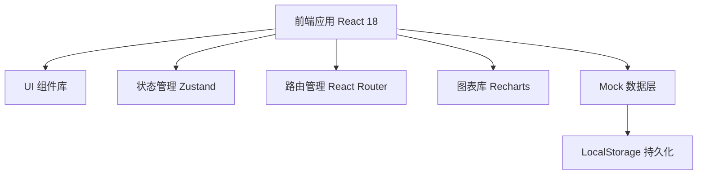
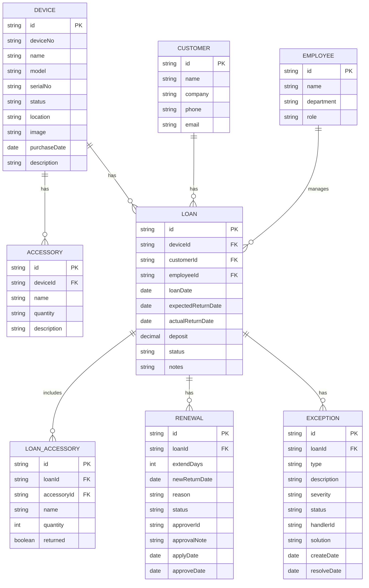

## 1. 架构设计



## 2. 技术描述

- **前端框架**：React@18 + TypeScript
- **构建工具**：Vite@5
- **样式方案**：TailwindCSS@3
- **状态管理**：Zustand
- **路由管理**：React Router@6
- **图表库**：Recharts
- **图标库**：Lucide React
- **数据持久化**：LocalStorage + Mock 数据
- **后端**：无（纯前端实现，使用 Mock 数据）

## 3. 路由定义

| 路由 | 页面 | 功能 |
|-----|------|------|
| /dashboard | 仪表盘 | 数据概览、到期提醒、快捷操作 |
| /devices | 样机列表 | 样机管理、筛选搜索 |
| /devices/new | 新增样机 | 创建新样机档案 |
| /devices/:id | 样机详情 | 样机信息、配件清单、历史记录 |
| /loans | 借出列表 | 所有借出记录 |
| /loans/new | 新建借出 | 创建借出申请 |
| /loans/:id | 借出详情 | 借出档案、状态时间线 |
| /loans/:id/return | 归还验收 | 四步归还验收流程 |
| /renewals | 续借管理 | 续借申请与审批 |
| /exceptions | 异常管理 | 异常单列表与处理 |
| /statistics | 统计分析 | 逾期排行、周转率、损坏分布 |

## 4. 数据模型

### 4.1 ER 图



### 4.2 类型定义

```typescript
// 样机状态
type DeviceStatus = 'available' | 'loaned' | 'maintenance' | 'scrapped';

// 借出状态
type LoanStatus = 'pending' | 'active' | 'returned' | 'overdue';

// 续借状态
type RenewalStatus = 'pending' | 'approved' | 'rejected';

// 异常类型
type ExceptionType = 'accessory_missing' | 'damage' | 'malfunction' | 'other';

// 异常严重程度
type ExceptionSeverity = 'low' | 'medium' | 'high';

// 异常状态
type ExceptionStatus = 'open' | 'processing' | 'resolved';

interface Device {
  id: string;
  deviceNo: string;
  name: string;
  model: string;
  serialNo: string;
  status: DeviceStatus;
  location: string;
  image?: string;
  purchaseDate: string;
  description: string;
  accessories: Accessory[];
}

interface Accessory {
  id: string;
  deviceId: string;
  name: string;
  quantity: number;
  description?: string;
}

interface Customer {
  id: string;
  name: string;
  company: string;
  phone: string;
  email?: string;
}

interface Employee {
  id: string;
  name: string;
  department: string;
  role: string;
}

interface Loan {
  id: string;
  deviceId: string;
  device?: Device;
  customerId: string;
  customer?: Customer;
  employeeId: string;
  employee?: Employee;
  loanDate: string;
  expectedReturnDate: string;
  actualReturnDate?: string;
  deposit: number;
  status: LoanStatus;
  notes?: string;
  loanAccessories: LoanAccessory[];
  renewals: Renewal[];
  exceptions: Exception[];
}

interface LoanAccessory {
  id: string;
  loanId: string;
  accessoryId: string;
  name: string;
  quantity: number;
  returned: boolean;
  returnQuantity?: number;
}

interface Renewal {
  id: string;
  loanId: string;
  extendDays: number;
  newReturnDate: string;
  reason: string;
  status: RenewalStatus;
  approverId?: string;
  approver?: Employee;
  approvalNote?: string;
  applyDate: string;
  approveDate?: string;
}

interface Exception {
  id: string;
  loanId: string;
  type: ExceptionType;
  description: string;
  severity: ExceptionSeverity;
  status: ExceptionStatus;
  handlerId?: string;
  handler?: Employee;
  solution?: string;
  createDate: string;
  resolveDate?: string;
}
```

## 5. 状态管理设计

使用 Zustand 管理全局状态，按领域拆分多个 store：

- **useDeviceStore**：样机数据管理
- **useLoanStore**：借出记录管理
- **useCustomerStore**：客户信息管理
- **useExceptionStore**：异常单管理
- **useStatisticsStore**：统计数据计算

## 6. 组件结构

```
src/
├── components/
│   ├── layout/          # 布局组件
│   │   ├── Sidebar.tsx
│   │   ├── Header.tsx
│   │   └── PageContainer.tsx
│   ├── common/          # 通用组件
│   │   ├── Button.tsx
│   │   ├── Card.tsx
│   │   ├── Modal.tsx
│   │   ├── Table.tsx
│   │   ├── StatusBadge.tsx
│   │   └── EmptyState.tsx
│   └── features/        # 业务组件
│       ├── dashboard/
│       ├── devices/
│       ├── loans/
│       ├── return/
│       ├── renewals/
│       ├── exceptions/
│       └── statistics/
├── pages/               # 页面组件
├── store/               # 状态管理
├── types/               # TypeScript 类型
├── utils/               # 工具函数
├── mock/                # Mock 数据
└── App.tsx
```
