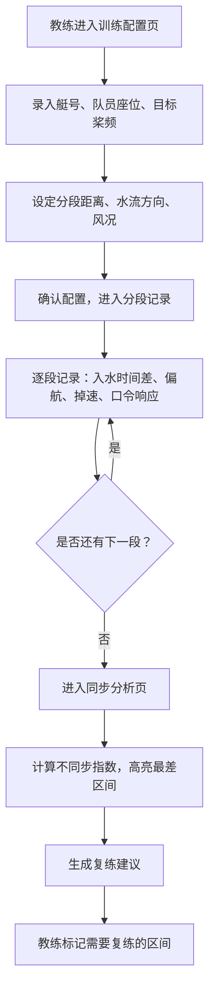

## 1. 产品概述

桨频同步训练页——面向划艇队双人艇教练的专项训练记录与分析工具。核心解决双人艇两名队员桨频和入水角度不同步的问题，通过分段记录入水时间差、偏航、掉速、口令响应等数据，自动标出最不同步区间，帮助教练精准制定复练计划。

- 目标用户：划艇队教练、双人艇队员
- 核心价值：将模糊的"划不到一起"量化为可追溯、可复练的数据指标

## 2. 核心功能

### 2.1 用户角色

| 角色 | 使用方式 | 核心权限 |
|------|----------|----------|
| 教练 | 直接使用 | 录入训练参数、记录分段数据、查看分析结果、标记复练区间 |
| 队员 | 查看反馈 | 查看自己的同步表现数据 |

### 2.2 功能模块

1. **训练配置页**：录入艇号、队员座位、目标桨频、分段距离、水流方向、风况
2. **分段记录页**：逐段记录入水时间差、左右偏航、冲刺掉速、口令响应
3. **同步分析页**：汇总全部分段数据，可视化同步指标，标出最不同步区间并生成复练建议

### 2.3 页面详情

| 页面名称 | 模块名称 | 功能描述 |
|----------|----------|----------|
| 训练配置页 | 艇号输入 | 输入双人艇编号（如 B-01） |
| 训练配置页 | 队员座位 | 选择/输入1号位和2号位队员姓名 |
| 训练配置页 | 目标桨频 | 设定本次训练目标桨频（次/分钟） |
| 训练配置页 | 分段距离 | 设定每段训练距离（米），可添加多段 |
| 训练配置页 | 水流方向 | 选择顺流/逆流/侧流 |
| 训练配置页 | 风况录入 | 选择风速等级和风向（顺风/逆风/侧风/无风） |
| 分段记录页 | 入水时间差 | 记录每段两名队员入水时间差（毫秒） |
| 分段记录页 | 左右偏航 | 记录每段艇身偏航角度（度）和方向（左/右） |
| 分段记录页 | 冲刺掉速 | 记录每段冲刺阶段桨频下降值（次/分钟） |
| 分段记录页 | 口令响应 | 记录口令发出到动作执行的响应时间（毫秒） |
| 同步分析页 | 分段数据总览 | 以表格和图表展示全部分段数据 |
| 同步分析页 | 不同步区间高亮 | 自动计算不同步指数，标红最差区间 |
| 同步分析页 | 复练建议 | 根据不同步区间生成下次复练重点建议 |

## 3. 核心流程

教练进入训练配置页，录入艇号、队员、目标桨频、分段距离、水流和风况等训练参数，确认后进入分段记录页。训练过程中，教练逐段录入入水时间差、左右偏航、冲刺掉速和口令响应数据。训练结束后，系统自动汇总数据进入同步分析页，计算各段不同步指数，将最不同步区间高亮标出，并生成复练建议供教练参考。

## 4. 用户界面设计

### 4.1 设计风格

- **主色调**：深蓝（#0A1628）为底，配合水面青绿（#00D4AA）为强调色，传达水上运动的清冷与力量感
- **辅助色**：暖橙（#FF6B35）用于警告/不同步标记，浅灰蓝（#8BA4C4）用于次级信息
- **按钮风格**：圆角微凸，深色底配亮色边框，hover 时边框发光
- **字体**：标题用 Outfit（几何感、运动感），正文用 DM Sans（清晰易读）
- **布局风格**：单页三步骤卡片式布局，顶部步骤指示器引导流程
- **图标**：使用 Lucide 图标，线条风格与整体简约运动感一致

### 4.2 页面设计概览

| 页面名称 | 模块名称 | UI 元素 |
|----------|----------|---------|
| 训练配置页 | 艇号与队员 | 输入框 + 座位标签（1号位/2号位），卡片式布局 |
| 训练配置页 | 目标桨频 | 数字输入 + 滑块，实时显示目标值 |
| 训练配置页 | 分段距离 | 可增删的分段列表，每段一个距离输入框 |
| 训练配置页 | 环境条件 | 水流方向选择器（图标按钮组）+ 风况下拉选择 |
| 分段记录页 | 当前段指示 | 顶部大号段号显示 + 进度条 |
| 分段记录页 | 入水时间差 | 数字输入 + 实时同步度指示器（色环） |
| 分段记录页 | 偏航记录 | 角度输入 + 方向切换按钮 + 小型偏航示意图 |
| 分段记录页 | 掉速与响应 | 双列数字输入卡片 |
| 同步分析页 | 数据总览 | 横向柱状图（各段不同步指数），红色高亮最差段 |
| 同步分析页 | 复练区间 | 列表展示不同步区间，可勾选标记复练 |
| 同步分析页 | 复练建议 | 文字卡片，基于数据自动生成训练建议 |

### 4.3 响应式设计

- 桌面端优先（教练多在岸上用笔记本操作）
- 平板适配：卡片单列排列，输入区域放大
- 移动端：简化为纵向滚动，关键输入优先展示

### 4.4 3D 场景指引

不适用
