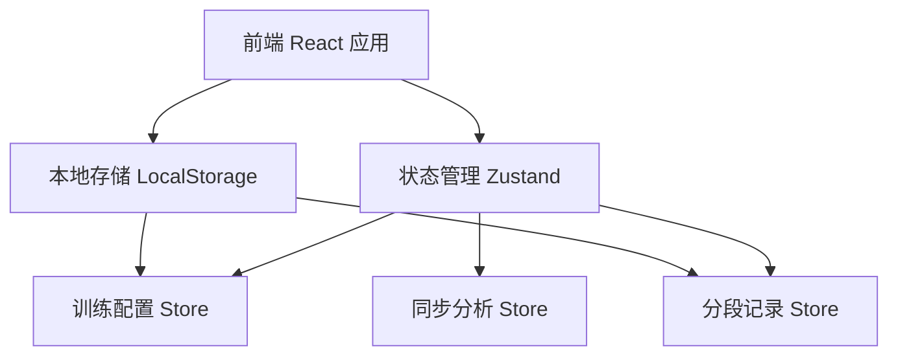
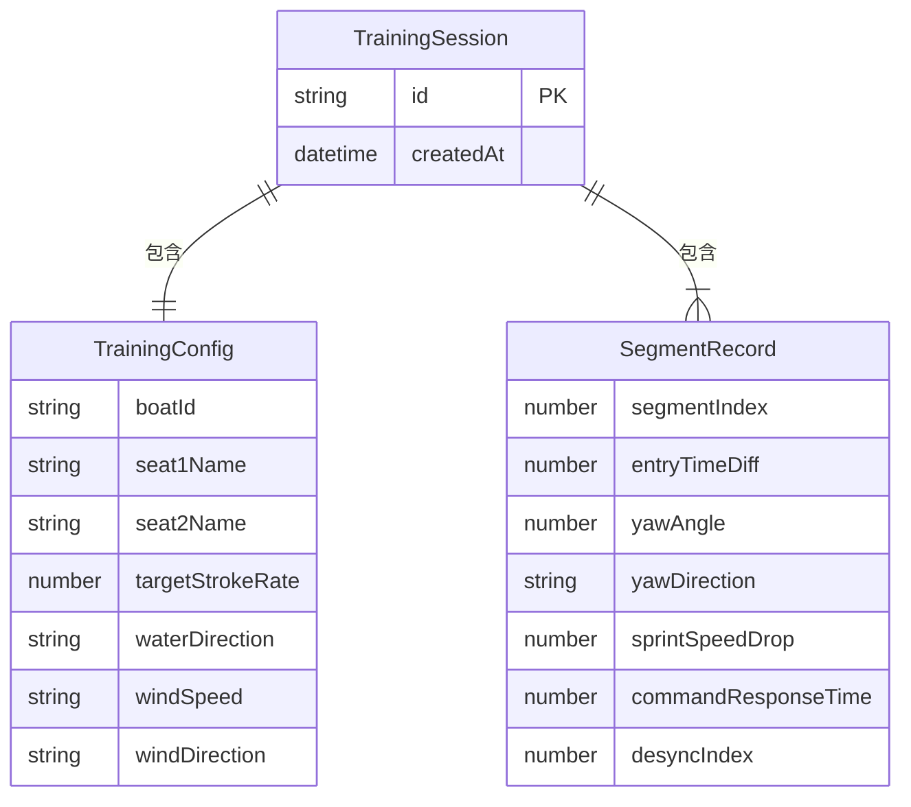

## 1. 架构设计



纯前端应用，无需后端服务。所有数据存储在浏览器 LocalStorage 中，支持教练离线使用。

## 2. 技术说明

- 前端：React@18 + TypeScript + Tailwind CSS@3 + Vite
- 初始化工具：vite-init
- 后端：无
- 数据库：无（使用 LocalStorage 持久化 + Zustand 状态管理）

## 3. 路由定义

| 路由 | 用途 |
|------|------|
| / | 训练配置页（首页）——录入艇号、队员、目标桨频、分段、环境条件 |
| /record | 分段记录页——逐段记录入水时间差、偏航、掉速、口令响应 |
| /analysis | 同步分析页——数据汇总、不同步区间高亮、复练建议 |

## 4. API 定义

无后端 API。前端通过 Zustand Store 管理状态，LocalStorage 持久化。

### 数据类型定义

```typescript
interface TrainingConfig {
  boatId: string
  seat1Name: string
  seat2Name: string
  targetStrokeRate: number
  segments: number[]
  waterDirection: "顺流" | "逆流" | "侧流"
  windSpeed: "无风" | "微风" | "中风" | "强风"
  windDirection: "顺风" | "逆风" | "侧风" | "无风"
}

interface SegmentRecord {
  segmentIndex: number
  entryTimeDiff: number
  yawAngle: number
  yawDirection: "左" | "右"
  sprintSpeedDrop: number
  commandResponseTime: number
  desyncIndex: number
}

interface TrainingSession {
  id: string
  config: TrainingConfig
  records: SegmentRecord[]
  reviewSegments: number[]
  createdAt: string
}
```

## 5. 服务端架构图

不适用

## 6. 数据模型

### 6.1 数据模型定义



### 6.2 数据定义语言

使用 LocalStorage 键值存储，键为 `rowing-sessions`，值为 `TrainingSession[]` 的 JSON 序列化。

不同步指数计算公式：
`desyncIndex = (entryTimeDiff / 100) * 0.35 + (yawAngle / 5) * 0.25 + (sprintSpeedDrop / 5) * 0.25 + (commandResponseTime / 200) * 0.15`

阈值设定：
- desyncIndex < 0.4：同步良好（绿色）
- 0.4 ≤ desyncIndex < 0.7：需注意（黄色）
- desyncIndex ≥ 0.7：严重不同步（红色，自动标记复练）
