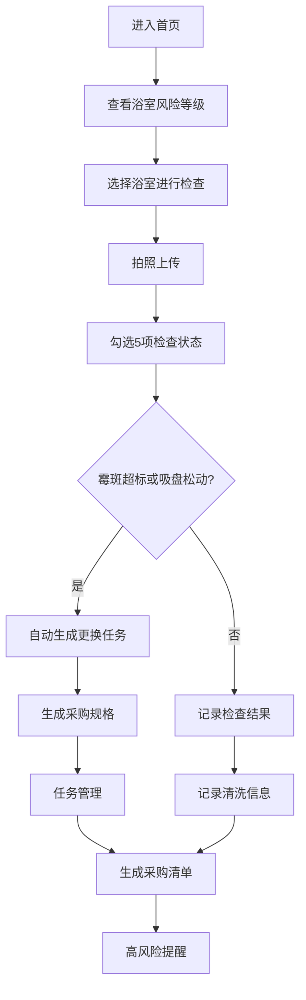

## 1. 产品概述

本产品是一款面向家庭用户的浴室防滑安全管理系统，专为家中有老人的家庭设计，用于管理浴室防滑垫的使用状态监控、定期检查、更换提醒和采购管理。通过数字化手段预防老人浴室滑倒风险。

- 核心目标：降低老人浴室滑倒风险，通过预防性维护替代事后补救
- 目标用户：家中有老人的家庭成员、家庭照护者
- 核心价值：主动安全管理，防患于未然

## 2. 核心功能

### 2.1 用户角色
| 角色 | 注册方式 | 核心权限 |
|------|----------|----------|
| 家庭用户 | 无需注册 | 管理浴室、记录检查、查看记录、生成采购清单 |

### 2.2 功能模块
1. **浴室风险概览页：浴室卡片列表、风险等级展示、使用时长、吸盘状态、边角状态、霉斑异味状态
2. **每周检查页：拍照上传、吸附力勾选、排水检查、清洗记录、晾干确认、浴椅扶手检查
3. **任务管理页：更换任务列表、采购规格展示、任务状态跟踪
4. **清洗记录页：清洗人、晾干地点、未处理时长、历史记录
5. **采购与提醒页：下月采购清单、高风险浴室提醒

### 2.3 页面详情
| 页面名称 | 模块名称 | 功能描述 |
|---------|----------|----------|
| 风险概览 | 浴室卡片 | 展示各浴室风险等级，颜色标识（绿/黄/红），显示防滑垫使用天数、吸盘状态、边角状态、霉斑状态 |
| 风险概览 | 快速操作 | 一键进入检查、查看清洗记录、生成更换任务 |
| 每周检查 | 拍照上传 | 支持调用摄像头拍照或上传本地照片 |
| 每周检查 | 状态勾选 | 吸附力、排水、清洗、晾干、浴椅扶手五项检查项 |
| 每周检查 | 异常检测 | 自动判断霉斑超标或吸盘松动时，自动生成更换任务和采购规格 |
| 任务管理 | 任务列表 | 待处理、进行中、已完成任务分类展示 |
| 任务管理 | 采购规格 | 防滑垫尺寸、材质、吸盘数量、厚度等规格参数 |
| 清洗记录 | 记录列表 | 清洗人、清洗时间、晾干地点、未处理时长 |
| 采购与提醒 | 采购清单 | 下月需要采购的物品清单及数量 |
| 采购与提醒 | 风险提醒 | 高风险浴室列表及建议措施 |

## 3. 核心流程

用户进入系统首页查看各浴室风险等级 → 选择浴室进行每周检查 → 拍照并勾选各项检查状态 → 系统自动判断是否需要更换 → 如需更换则自动生成任务和采购规格 → 记录清洗信息 → 查看采购清单和风险提醒

## 4. 用户界面设计

### 4.1 设计风格
- 主色调：温暖的橙色系（#FF6B35）代表关怀与提醒，搭配清新的青色（#00B4A8）代表安全与健康
- 辅助色：红色（#E63946）表示高风险，黄色（#F4A261）表示中等风险，绿色（#2A9D8F）表示安全
- 字体：标题使用"Noto Sans SC" Bold，正文使用"Noto Sans SC" Regular
- 按钮风格：圆角设计，带有微立体效果，悬停有阴影变化
- 布局风格：卡片式布局，顶部导航栏，左侧菜单
- 图标风格：使用 lucide-react 线性图标，搭配 emoji 增强亲和力

### 4.2 页面设计概述
| 页面名称 | 模块名称 | UI 元素 |
|---------|----------|----------|
| 风险概览 | 浴室卡片 | 风险等级色块、状态指标图标组、使用进度条、快速操作按钮 |
| 每周检查 | 检查表单 | 照片上传区域、复选框组、状态说明文字、提交按钮 |
| 任务管理 | 任务卡片 | 任务状态标签、采购规格详情、操作按钮组 |
| 清洗记录 | 记录列表 | 时间线布局、人员头像、地点标签、时长徽章 |
| 采购与提醒 | 清单卡片 | 物品图标、数量标注、优先级标签、一键导出 |

### 4.3 响应式设计
- 桌面端优先设计，采用 1280px 基准宽度
- 平板端：卡片自动换行，导航栏保持顶部
- 移动端：底部导航栏，卡片单列布局，触控区域放大至 44px
- 所有交互元素支持触摸操作

### 4.4 动效设计
- 页面加载：渐入动画，卡片依次出现
- 风险等级变化：颜色过渡动画
- 按钮点击：缩放反馈效果
- 任务完成：庆祝动效
- 滚动：平滑滚动效果
