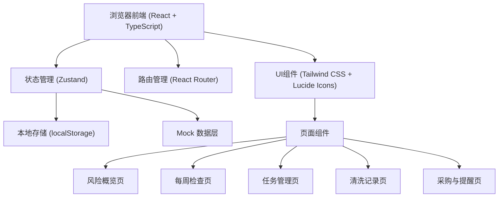
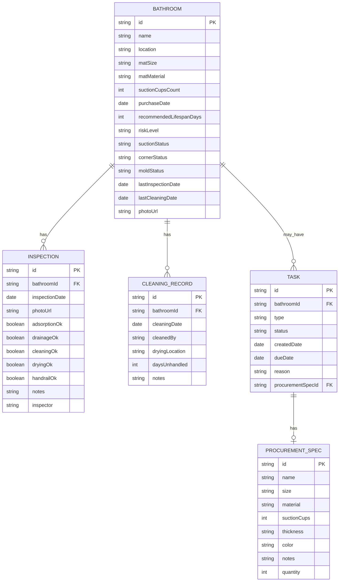

## 1. 架构设计



## 2. 技术描述

- 前端：React@18 + TypeScript + Vite
- 状态管理：Zustand
- 路由：react-router-dom@6
- 样式：Tailwind CSS@3
- 图标：lucide-react
- 数据存储：localStorage（前端持久化）+ Mock 数据
- 初始化工具：vite-init

## 3. 路由定义

| 路由 | 页面 | 用途 |
|------|------|------|
| / | 风险概览页 | 展示各浴室风险等级和状态 |
| /inspection/:bathroomId | 每周检查页 | 执行浴室防滑垫检查 |
| /tasks | 任务管理页 | 查看和管理更换任务 |
| /cleaning-records | 清洗记录页 | 查看和管理清洗记录 |
| /procurement | 采购与提醒页 | 查看采购清单和风险提醒 |

## 4. 数据模型

### 4.1 数据模型定义



### 4.2 TypeScript 类型定义

```typescript
// 浴室信息
interface Bathroom {
  id: string;
  name: string;
  location: string;
  matSize: string;
  matMaterial: string;
  suctionCupsCount: number;
  purchaseDate: string;
  recommendedLifespanDays: number;
  riskLevel: 'safe' | 'warning' | 'danger';
  suctionStatus: 'good' | 'normal' | 'poor';
  cornerStatus: 'good' | 'normal' | 'poor';
  moldStatus: 'none' | 'mild' | 'severe';
  lastInspectionDate: string | null;
  lastCleaningDate: string | null;
  photoUrl: string | null;
}

// 检查记录
interface Inspection {
  id: string;
  bathroomId: string;
  inspectionDate: string;
  photoUrl: string | null;
  adsorptionOk: boolean;
  drainageOk: boolean;
  cleaningOk: boolean;
  dryingOk: boolean;
  handrailOk: boolean;
  notes: string;
  inspector: string;
}

// 清洗记录
interface CleaningRecord {
  id: string;
  bathroomId: string;
  cleaningDate: string;
  cleanedBy: string;
  dryingLocation: string;
  daysUnhandled: number;
  notes: string;
}

// 任务
interface Task {
  id: string;
  bathroomId: string;
  type: 'replace' | 'clean' | 'repair';
  status: 'pending' | 'in_progress' | 'completed';
  createdDate: string;
  dueDate: string;
  reason: string;
  procurementSpecId: string | null;
}

// 采购规格
interface ProcurementSpec {
  id: string;
  name: string;
  size: string;
  material: string;
  suctionCups: number;
  thickness: string;
  color: string;
  notes: string;
  quantity: number;
}

// 采购清单项
interface ProcurementItem {
  spec: ProcurementSpec;
  bathroomName: string;
  urgency: 'high' | 'medium' | 'low';
}
```

## 5. 状态管理设计

使用 Zustand 管理全局状态：

```typescript
interface AppState {
  bathrooms: Bathroom[];
  inspections: Inspection[];
  cleaningRecords: CleaningRecord[];
  tasks: Task[];
  procurementSpecs: ProcurementSpec[];
  
  // Actions
  addBathroom: (bathroom: Omit<Bathroom, 'id'>) => void;
  updateBathroom: (id: string, updates: Partial<Bathroom>) => void;
  addInspection: (inspection: Omit<Inspection, 'id'>) => void;
  addCleaningRecord: (record: Omit<CleaningRecord, 'id'>) => void;
  addTask: (task: Omit<Task, 'id'>) => void;
  updateTask: (id: string, updates: Partial<Task>) => void;
  addProcurementSpec: (spec: Omit<ProcurementSpec, 'id'>) => string;
  
  // Derived data
  getHighRiskBathrooms: () => Bathroom[];
  getProcurementList: () => ProcurementItem[];
  calculateRiskLevel: (bathroom: Bathroom) => 'safe' | 'warning' | 'danger';
  checkAndCreateReplacementTask: (bathroomId: string, inspection: Inspection) => void;
}
```

## 6. 项目结构

```
src/
├── components/          # 可复用组件
│   ├── BathroomCard.tsx
│   ├── RiskBadge.tsx
│   ├── StatusIndicator.tsx
│   ├── PhotoUpload.tsx
│   ├── CheckboxGroup.tsx
│   ├── TaskCard.tsx
│   ├── CleaningRecordItem.tsx
│   └── ProcurementItemCard.tsx
├── pages/              # 页面组件
│   ├── Dashboard.tsx
│   ├── Inspection.tsx
│   ├── Tasks.tsx
│   ├── CleaningRecords.tsx
│   └── Procurement.tsx
├── store/              # 状态管理
│   └── useStore.ts
├── types/              # TypeScript 类型定义
│   └── index.ts
├── utils/              # 工具函数
│   ├── dateUtils.ts
│   ├── riskCalculator.ts
│   └── idGenerator.ts
├── data/               # Mock 数据
│   └── mockData.ts
├── App.tsx
├── main.tsx
└── index.css
```
