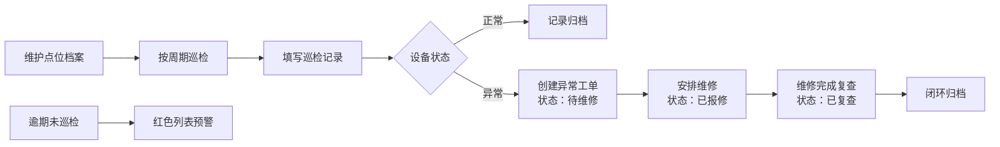

## 1. 产品概述
消防巡检管理系统，用于解决办公室灭火器、应急灯、安全出口等消防设备巡检记录零散、难以追踪的问题。系统支持点位档案管理、巡检记录填报、异常状态闭环管理和统计分析，帮助管理员全面掌握消防设备状态。

- **目标用户**：物业管理员、消防安全负责人、巡检人员
- **核心价值**：巡检记录可追溯、异常状态闭环管理、逾期预警、数据可视化统计

## 2. 核心功能

### 2.1 用户角色
| 角色 | 注册方式 | 核心权限 |
|------|----------|----------|
| 管理员 | 系统内置 | 点位档案管理、查看所有巡检记录、统计分析、异常状态管理 |
| 巡检员 | 系统内置 | 执行巡检、填写巡检记录、上传照片、上报异常 |

### 2.2 功能模块
1. **点位档案管理**：消防设备点位的增删改查，包含区域、设备类型、编号、责任人、检查周期、现场照片
2. **巡检记录**：巡检时填报状态、压力值/亮灯情况、异常说明、现场照片
3. **异常管理**：异常状态流转（待维修→已报修→已复查），红色逾期列表提醒
4. **统计分析**：每层楼合格率、最常异常设备类型、本月未闭环问题统计

### 2.3 页面详情
| 页面名称 | 模块名称 | 功能描述 |
|---------|----------|----------|
| 点位档案页 | 点位列表 | 分页展示所有点位，支持按区域、设备类型筛选 |
| 点位档案页 | 点位表单 | 新增/编辑点位：区域、设备类型、编号、责任人、检查周期、现场照片上传 |
| 巡检记录页 | 巡检列表 | 展示巡检记录，按时间倒序，支持状态筛选 |
| 巡检记录页 | 巡检填报 | 选择点位后填报：状态（正常/异常）、压力值、亮灯情况、异常说明、照片上传 |
| 异常管理页 | 异常列表 | 展示所有异常记录，支持状态流转操作 |
| 异常管理页 | 逾期红色列表 | 醒目展示逾期未巡检的点位 |
| 统计分析页 | 楼层合格率 | 柱状图展示各楼层设备合格率 |
| 统计分析页 | 异常类型统计 | 饼图展示最常出现异常的设备类型 |
| 统计分析页 | 未闭环问题 | 列表展示本月尚未闭环的异常问题 |

## 3. 核心流程

### 3.1 巡检流程
管理员先维护点位档案，巡检员按周期执行巡检。巡检时选择点位，检查设备状态并填报记录。如发现异常，系统自动创建异常工单，状态标记为"待维修"。管理员安排维修后标记为"已报修"，维修完成后巡检员复查并标记为"已复查"闭环。

## 4. 用户界面设计

### 4.1 设计风格
- **主色调**：消防红 (#DC2626) 作为主色，搭配深灰 (#1F2937) 作为中性色
- **辅助色**：正常绿 (#10B981)、警告橙 (#F59E0B)、异常红 (#EF4444)
- **按钮风格**：圆角矩形，悬停有轻微缩放和阴影变化
- **字体**：标题使用 "Noto Sans SC" 黑体，正文使用系统字体
- **布局风格**：顶部导航 + 左侧菜单 + 右侧内容区，卡片式布局
- **图标风格**：使用 Font Awesome 图标，消防相关图标突出显示

### 4.2 页面设计概述
| 页面名称 | 模块名称 | UI元素 |
|---------|----------|--------|
| 点位档案页 | 点位列表 | 搜索框、筛选下拉、数据表格、操作按钮、分页器 |
| 点位档案页 | 点位表单 | 模态框表单、文件上传组件、下拉选择、日期选择 |
| 巡检记录页 | 巡检列表 | 时间轴样式展示记录、状态标签、照片缩略图 |
| 巡检记录页 | 巡检填报 | 表单向导、分步填写、实时预览 |
| 异常管理页 | 异常列表 | 状态标签可点击切换、操作按钮组、红色高亮逾期项 |
| 异常管理页 | 逾期红色列表 | 红色背景卡片、闪烁提醒图标、快捷巡检按钮 |
| 统计分析页 | 数据可视化 | ECharts 柱状图、饼图、数据卡片、统计数字 |

### 4.3 响应式设计
- 桌面端优先设计，适配 1280px 及以上分辨率
- 平板端自适应，左侧菜单可折叠
- 移动端简化布局，采用底部导航，表格转卡片展示
- 所有表单元素支持触摸操作，最小点击区域 44x44px
