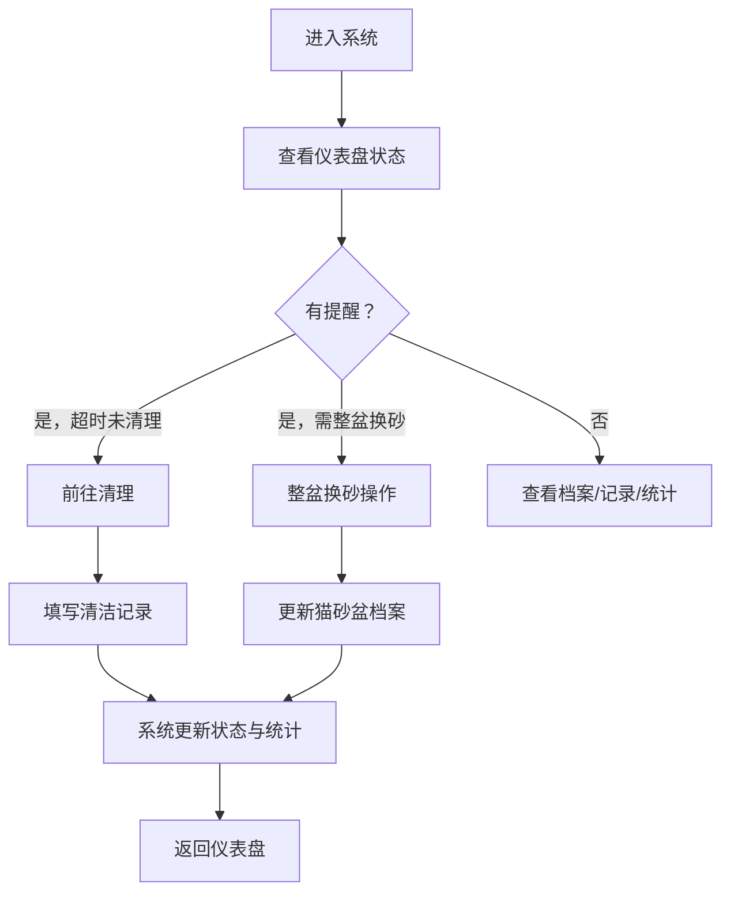

# 猫砂盆清洁管理系统 PRD

## 1. 产品概述

本系统是一个家庭猫砂盆清洁排班与记录管理工具，解决家庭成员间关于猫砂盆清洁责任的混乱问题。通过记录每一次清理、追踪整盆换砂周期、智能提醒和数据分析，让猫砂盆始终保持清洁卫生。

- 核心目标：消除"谁铲过砂"的家庭矛盾，科学管理多猫砂盆清洁周期
- 目标用户：多猫家庭、共享养猫的家庭成员
- 产品价值：提高猫咪生活环境健康，减少家庭沟通成本

## 2. 核心功能

### 2.1 用户角色

| 角色 | 注册方式 | 核心权限 |
|------|----------|----------|
| 家庭成员 | 系统内置成员添加 | 查看/添加清洁记录、管理猫砂盆档案、查看统计报表 |

### 2.2 功能模块

1. **总览仪表盘**：清洁状态概览、待办提醒、今日排班、最近活动
2. **猫砂盆档案**：盆的基础信息管理（位置、猫咪、砂种、容量、照片、换砂历史）
3. **每日清洁记录**：铲屎记录、异味评级、结团情况、补砂记录
4. **提醒与告警**：超时未清理提醒、连续异味高提示整盆换砂
5. **统计报表**：家庭成员贡献榜、各盆平均间隔、猫砂消耗、深度清洗清单

### 2.3 页面详情

| 页面名称 | 模块名称 | 功能描述 |
|----------|----------|----------|
| 总览仪表盘 | 状态卡片 | 显示各猫砂盆当前状态（正常/需清理/需换砂），上次清理时间、负责人 |
| 总览仪表盘 | 智能提醒区 | 显示待办提醒卡片、超时未清理告警、整盆换砂建议 |
| 总览仪表盘 | 今日排班 | 显示当日各时段排班建议与分配情况 |
| 总览仪表盘 | 最近活动流 | 时间线展示最近清洁记录，含负责人、时间、猫砂盆编号 |
| 猫砂盆档案 | 猫砂盆列表 | 卡片网格展示所有猫砂盆，含缩略图、位置、猫咪标签 |
| 猫砂盆档案 | 猫砂盆详情 | 完整信息：位置、使用猫咪、砂种、容量、上次整换时间、照片轮播、换砂历史时间线 |
| 猫砂盆档案 | 新增/编辑表单 | 位置、猫咪（多选）、砂种下拉、容量、照片上传、整换间隔设置 |
| 清洁记录 | 记录列表 | 时间倒序展示所有记录，可按盆/人/日期筛选 |
| 清洁记录 | 新增记录表单 | 选择猫砂盆、负责人、当前时间、异味等级（1-5星）、结团情况（少/中/多）、是否补砂、备注 |
| 清洁记录 | 快速签到 | 一键快速记录铲屎（默认负责人为当前用户，其他默认值） |
| 统计报表 | 成员贡献榜 | 柱状图展示各成员清理次数排名、占比饼图 |
| 统计报表 | 盆使用分析 | 各盆平均清理间隔折线图、清理次数统计 |
| 统计报表 | 猫砂消耗 | 补砂记录统计、预计下次购买时间建议 |
| 统计报表 | 深度清洗清单 | 根据使用时长和异味记录标记需深度清洗的猫砂盆 |

## 3. 核心流程

### 3.1 日常清洁流程

家庭成员打开应用 → 查看仪表盘待办提醒 → 选择需清理的猫砂盆 → 点击"快速记录"或填写详细记录 → 系统更新状态 → 刷新统计数据

### 3.2 整盆换砂流程

系统根据连续异味高/到达设定间隔触发提醒 → 家庭成员处理 → 记录整盆换砂事件 → 更新"上次整盆更换时间 → 重置计时

### 3.3 流程图

## 4. 用户界面设计

### 4.1 设计风格

- **主色调**：温暖大地色系（奶油米色 #F5EBDC + 鼠尾草绿 #A8C5A0 + 陶土橙 #D4896A）
- **辅助色**：柔和粉 #E8C4C4（提醒告警色）、雾霾蓝 #A4B8C4（信息色）
- **按钮风格**：圆润大圆角（16px）、柔和阴影、悬停微动效
- **字体**：标题使用「霞鹜文楷（LXGW WenKai）展示字体 + Inter 正文字体
- **布局风格**：卡片式布局、柔和阴影、大量留白、自然有机形态
- **图标风格**：猫咪主题emoji + 线性图标（🐾 🐱 🧹 🏠），线条圆润
- **整体调性**：温馨自然、轻松治愈、温暖家庭感

### 4.2 页面设计概览

| 页面名称 | 模块名称 | UI元素 |
|----------|----------|----------|
| 总览仪表盘 | 状态卡片 | 卡片带猫咪头像、状态指示小圆点、上次清理相对时间、渐变背景、淡入动画 |
| 总览仪表盘 | 智能提醒区 | 告警卡片醒目橙色边框、脉冲动画、提醒铃铛图标 |
| 总览仪表盘 | 时间线 | 左右交替、猫爪印分隔符、淡入滚动动画 |
| 猫砂盆档案 | 盆卡片 | 圆角照片、位置标签、猫咪头像组、状态徽章、悬停上浮效果 |
| 猫砂盆档案 | 详情弹窗 | 大图展示、信息网格布局、历史时间线 |
| 清洁记录 | 记录列表 | 交替行背景、星级异味可视化、结团情况图标化 |
| 统计报表 | 图表 | 柔和渐变色、动画加载、悬停显示详情 |

### 4.3 响应式设计

- 桌面端（1200px+）：四栏网格布局，侧边导航
- 平板（768-1199px）：两栏布局，顶部导航
- 移动端（<768px）：单列布局，底部Tab导航，触摸优化大按钮

### 4.4 动效设计

- 页面加载：卡片依次淡入（staggered 100ms间隔）
- 状态变化：颜色过渡动画
- 提醒卡片：柔和脉冲效果
- 悬停交互：卡片轻微上浮+阴影加深
- 提交成功：绿色对勾弹出动画
