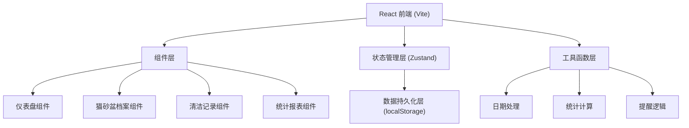
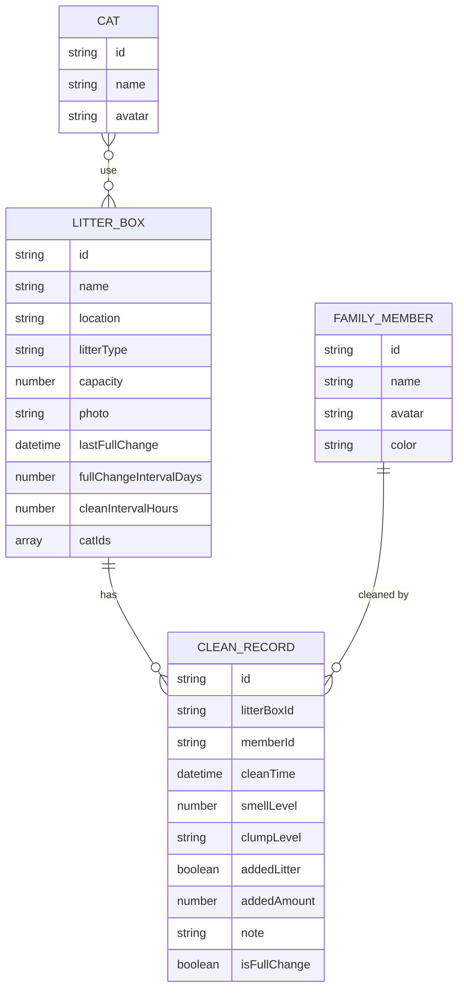

# 猫砂盆清洁管理系统 技术架构

## 1. 架构设计



## 2. 技术选型说明

- **前端框架**：React@18 + TypeScript
- **构建工具**：Vite@5（快速开发、热更新）
- **样式方案**：TailwindCSS@3（原子化CSS）
- **状态管理**：Zustand（轻量级、极简API）
- **图表库**：Recharts（React原生图表库）
- **图标**：Lucide React（现代化线性图标）
- **数据存储**：localStorage（纯前端方案，内置mock数据）
- **路由**：React Router DOM@6

## 3. 路由定义

| 路由 | 用途 |
|------|------|
| / | 总览仪表盘（默认页） |
| /litter-boxes | 猫砂盆档案列表 |
| /litter-boxes/:id | 猫砂盆详情 |
| /records | 清洁记录列表 |
| /stats | 统计报表 |
| /settings | 设置（家庭成员管理） |

## 4. 数据模型

### 4.1 ER图



### 4.2 TypeScript 类型定义

```typescript
// 家庭成员
interface FamilyMember {
  id: string;
  name: string;
  avatar: string; // emoji或头像URL
  color: string; // 主题色
}

// 猫咪
interface Cat {
  id: string;
  name: string;
  avatar: string;
}

// 猫砂种类
type LitterType = '膨润土' | '豆腐砂' | '混合砂' | '水晶砂' | '松木砂' | '纸砂';

// 猫砂盆
interface LitterBox {
  id: string;
  name: string;
  location: string;
  litterType: LitterType;
  capacity: number; // 升
  photo: string; // 图片URL
  lastFullChange: string; // ISO日期
  fullChangeIntervalDays: number; // 整盆换砂间隔(天)
  cleanIntervalHours: number; // 日常清理间隔(小时)
  catIds: string[];
}

// 结团等级
type ClumpLevel = '少' | '中' | '多';

// 清洁记录
interface CleanRecord {
  id: string;
  litterBoxId: string;
  memberId: string;
  cleanTime: string; // ISO日期
  smellLevel: 1 | 2 | 3 | 4 | 5; // 1=无异味, 5=非常臭
  clumpLevel: ClumpLevel;
  addedLitter: boolean;
  addedAmount: number; // 补充量(克)
  note?: string;
  isFullChange: boolean; // 是否整盆更换
}

// 提醒类型
type AlertType = 'overdue_clean' | 'full_change_due' | 'high_smell_chain' | 'deep_clean_needed';

interface Alert {
  id: string;
  type: AlertType;
  litterBoxId: string;
  message: string;
  severity: 'info' | 'warning' | 'danger';
  createdAt: string;
}
```

### 4.3 Mock初始数据

```typescript
// 预置家庭成员
const initialMembers: FamilyMember[] = [
  { id: 'm1', name: '爸爸', avatar: '👨', color: '#6B8E7A' },
  { id: 'm2', name: '妈妈', avatar: '👩', color: '#C48E9F' },
  { id: 'm3', name: '小明', avatar: '🧑', color: '#8BA4B8' },
  { id: 'm4', name: '小红', avatar: '👧', color: '#D4A373' },
];

// 预置猫咪
const initialCats: Cat[] = [
  { id: 'c1', name: '橘子', avatar: '🐱' },
  { id: 'c2', name: '煤球', avatar: '🐈‍⬛' },
  { id: 'c3', name: '年糕', avatar: '🐈' },
];

// 预置猫砂盆
const initialLitterBoxes: LitterBox[] = [
  {
    id: 'lb1',
    name: '主卫盆',
    location: '主人卫生间',
    litterType: '豆腐砂',
    capacity: 12,
    photo: '...',
    lastFullChange: '2026-06-07T10:00:00Z',
    fullChangeIntervalDays: 14,
    cleanIntervalHours: 12,
    catIds: ['c1', 'c2'],
  },
  // ...更多
];
```

## 5. 核心算法逻辑

### 5.1 清理状态判断

```
输入: 猫砂盆ID, 当前时间
获取: 最近一次清理记录时间 T_last, 设置间隔 H
计算: 已过小时数 H_passed = (now - T_last) / 3600000
规则:
  - H_passed < 0.8*H → 状态: 正常 (绿色)
  - 0.8*H ≤ H_passed < H → 状态: 即将到期 (黄色)
  - H_passed ≥ H → 状态: 已超时 (红色/告警)
```

### 5.2 整盆换砂提醒

```
连续N次(默认3次)异味等级≥4 OR
(当前日期 - 上次整盆换砂日期) ≥ 设定间隔天数
→ 触发"整盆换砂"提醒
```

### 5.3 深度清洗判定

```
累计使用天数 > 90天 AND
累计清洁次数 > 200次 OR
平均异味等级 > 3.5
→ 加入深度清洗清单
```

### 5.4 猫砂消耗估算

```
总消耗量 = 所有补砂记录 addedAmount 之和
整盆更换消耗量 = 次数 × 容量(升) × 密度(约600g/升)
日均消耗 = 总消耗量 / 使用天数
预计耗尽日 = 当前库存 / 日均消耗
```

## 6. 目录结构

```
src/
├── assets/              # 静态资源
├── components/          # 可复用组件
│   ├── layout/         # 布局组件
│   │   ├── Sidebar.tsx
│   │   └── Header.tsx
│   ├── common/         # 通用组件
│   │   ├── StatusBadge.tsx
│   │   ├── StarRating.tsx
│   │   ├── AlertCard.tsx
│   │   └── EmptyState.tsx
│   └── features/       # 业务组件
│       ├── dashboard/
│       ├── litter-box/
│       ├── records/
│       └── stats/
├── pages/              # 页面组件
│   ├── Dashboard.tsx
│   ├── LitterBoxList.tsx
│   ├── LitterBoxDetail.tsx
│   ├── Records.tsx
│   ├── Stats.tsx
│   └── Settings.tsx
├── store/              # Zustand状态管理
│   └── useAppStore.ts
├── types/              # 类型定义
│   └── index.ts
├── utils/              # 工具函数
│   ├── date.ts
│   ├── stats.ts
│   └── alerts.ts
├── data/               # Mock数据
│   └── seed.ts
├── App.tsx
├── main.tsx
└── index.css
```
