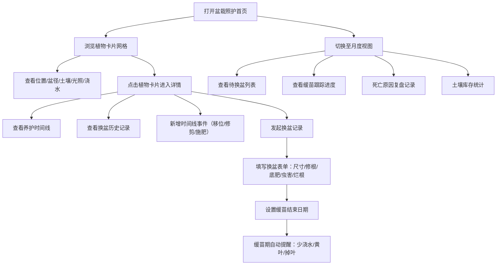

## 1. 产品概述
盆栽照护管理系统，帮助养花人系统化记录每盆植物的生长状态、换盆历史和日常养护操作，解决"记不住上次换了什么土"的痛点。
- 核心目标：降低植物养护遗忘成本，建立可追溯的养护档案，通过月度视图辅助决策
- 目标用户：家庭盆栽爱好者、多盆植物管理者、注重记录的养花人

## 2. 核心功能

### 2.1 功能模块
1. **盆栽照护首页**：植物卡片列表、核心信息一览、快捷操作
2. **植物详情页**：完整养护档案、时间线、换盆记录、照片墙
3. **换盆记录页**：独立的换盆表单、缓苗期管理、健康评估
4. **月度视图页**：换盆提醒、缓苗跟踪、死亡复盘、土壤库存统计

### 2.2 页面详情
| 页面名称 | 模块名称 | 功能描述 |
|---------|---------|---------|
| 盆栽照护首页 | 顶部导航 | 页面切换、搜索、新增植物入口 |
| 盆栽照护首页 | 植物卡片网格 | 展示位置、盆径、土壤配比、光照、浇水节奏、最近照片缩略图 |
| 盆栽照护首页 | 状态标签 | 缓苗期标记、浇水提醒、健康状态 |
| 植物详情页 | 基础信息区 | 位置、盆径、土壤配比、光照、浇水节奏、当前照片 |
| 植物详情页 | 时间线 | 移位、修剪、施肥、浇水等操作的时间线记录 |
| 植物详情页 | 换盆历史 | 历次换盆记录列表，点击查看详情 |
| 植物详情页 | 缓苗状态卡 | 缓苗期内显示提醒：少浇水、观察黄叶和掉叶 |
| 换盆记录页 | 换盆表单 | 新盆尺寸、是否修根、底肥种类、虫害情况、烂根情况、土壤配比 |
| 换盆记录页 | 缓苗设置 | 缓苗结束日期、缓苗提醒开关 |
| 换盆记录页 | 照片上传 | 换盆前后对比照片 |
| 月度视图页 | 待换盆列表 | 根据上次换盆时间和植物类型列出该换盆的植物 |
| 月度视图页 | 缓苗跟踪 | 本月处于缓苗期的植物及剩余天数 |
| 月度视图页 | 死亡复盘 | 已死亡植物的死因记录和分析 |
| 月度视图页 | 土壤库存 | 颗粒土、营养土剩余量统计和采购提醒 |

## 3. 核心流程

用户打开应用后，在首页浏览所有植物卡片，快速掌握每盆植物的核心照护信息。点击某张卡片进入详情页，可查看完整时间线和换盆历史。需要换盆时，通过独立的换盆记录表单详细记录新盆尺寸、修根、底肥、虫害、烂根等情况，并设置缓苗结束日期。缓苗期内系统自动在详情页显示少浇水、观察黄叶掉叶的提醒。日常的移位、修剪、施肥操作通过时间线记录。月度视图汇总展示该换盆的植物、刚缓苗的植物、死亡原因复盘以及土壤库存情况，帮助用户进行月度养护规划。

## 4. 用户界面设计

### 4.1 设计风格
- **主色调**：深森林绿 #2D4A3E 作为主色，搭配苔藓绿 #6B8F71、陶土橙 #C17F59 作为点缀
- **背景色**：米白色 #F5F1E8 温暖自然，不刺眼
- **强调色**：叶片黄 #E8B34A 用于提醒和标记
- **按钮风格**：圆润胶囊形按钮，轻微阴影，hover 时轻微上浮
- **字体**：标题用衬线字体 Lora，正文用无衬线字体 Noto Sans SC
- **布局风格**：卡片式布局，错落的网格排列，植物照片占据视觉重心
- **图标风格**：线性手绘风格图标，叶片、花盆、水壶、剪刀等植物相关图形

### 4.2 页面设计概述
| 页面名称 | 模块名称 | UI元素 |
|---------|---------|--------|
| 盆栽照护首页 | 顶部导航 | 深绿背景、白色文字、左侧Logo、右侧搜索和添加按钮 |
| 盆栽照护首页 | 植物卡片网格 | 响应式网格、每张卡片顶部为照片、中部为核心信息标签、底部为状态条 |
| 盆栽照护首页 | 植物卡片 | 圆角16px、微妙阴影、hover时阴影加深轻微上浮、缓苗期卡片有金色边框 |
| 植物详情页 | 基础信息区 | 顶部大照片横幅、下方两行标签展示位置/盆径/土壤/光照/浇水 |
| 植物详情页 | 时间线 | 左侧垂直线条、右侧事件卡片、每个节点有图标区分事件类型 |
| 植物详情页 | 换盆历史 | 可折叠手风琴式列表、展开显示换盆详情 |
| 植物详情页 | 缓苗提醒卡 | 暖黄色背景、叶片图标、醒目的提醒文字 |
| 换盆记录页 | 表单区 | 分组表单、每组有小标题、输入框有微妙边框聚焦效果 |
| 月度视图页 | 四个象限卡片 | 2x2网格布局、每个象限有不同主题色边框、数据可视化小图表 |

### 4.3 响应式
- 桌面端优先设计，采用CSS Grid布局
- 平板端：卡片网格从3列变为2列，月度视图四象限变为单列堆叠
- 移动端：单列布局，导航折叠为底部标签栏，交互区域优化为触控友好尺寸
- 所有间距和字体大小使用rem单位，确保缩放一致性
