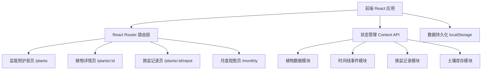
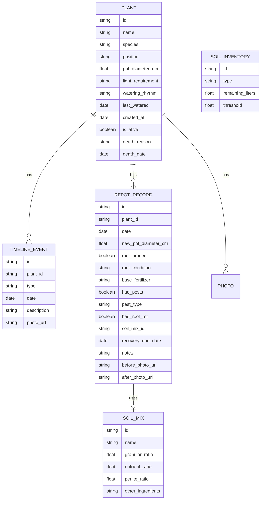

## 1. 架构设计



## 2. 技术描述
- **前端框架**：React@18 + TypeScript
- **构建工具**：Vite@5
- **样式方案**：TailwindCSS@3 + CSS 变量
- **路由方案**：React Router@6
- **状态管理**：React Context API + useReducer
- **图标方案**：Lucide React（简约线性图标）
- **数据存储**：localStorage 本地持久化（无后端，纯前端应用）
- **日期处理**：date-fns 轻量级日期库

## 3. 路由定义
| 路由 | 页面组件 | 用途 |
|-----|---------|------|
| `/` | PlantListPage | 盆栽照护首页，展示所有植物卡片 |
| `/plants` | PlantListPage | 同上（别名） |
| `/plants/:id` | PlantDetailPage | 植物详情页，包含时间线、换盆历史、缓苗提醒 |
| `/plants/:id/repot` | RepotPage | 换盆记录表单页 |
| `/plants/create` | CreatePlantPage | 新增植物 |
| `/monthly` | MonthlyViewPage | 月度视图：待换盆、缓苗跟踪、死亡复盘、土壤库存 |

## 4. 数据模型

### 4.1 ER 图



### 4.2 核心 TypeScript 类型定义

```typescript
// 植物
interface Plant {
  id: string;
  name: string;
  species?: string;
  position: string;
  potDiameterCm: number;
  currentSoilMixId: string;
  lightRequirement: '低光' | '散射光' | '半日照' | '全日照';
  wateringRhythm: string;
  lastWatered?: string;
  latestPhotoUrl?: string;
  createdAt: string;
  isAlive: boolean;
  deathReason?: string;
  deathDate?: string;
}

// 土壤配比
interface SoilMix {
  id: string;
  name: string;
  granularRatio: number;
  nutrientRatio: number;
  perliteRatio: number;
  otherIngredients?: string;
}

// 时间线事件
type TimelineEventType = 'water' | 'move' | 'prune' | 'fertilize' | 'photo' | 'other';

interface TimelineEvent {
  id: string;
  plantId: string;
  type: TimelineEventType;
  date: string;
  description?: string;
  photoUrl?: string;
}

// 换盆记录
interface RepotRecord {
  id: string;
  plantId: string;
  date: string;
  newPotDiameterCm: number;
  rootPruned: boolean;
  rootCondition: '健康' | '轻微缠绕' | '严重缠绕' | '有烂根';
  baseFertilizer?: string;
  hadPests: boolean;
  pestType?: string;
  hadRootRot: boolean;
  soilMixId: string;
  recoveryEndDate: string;
  notes?: string;
  beforePhotoUrl?: string;
  afterPhotoUrl?: string;
}

// 土壤库存
type SoilType = '颗粒土' | '营养土' | '珍珠岩' | '其他';

interface SoilInventory {
  id: string;
  type: SoilType;
  name: string;
  remainingLiters: number;
  thresholdLiters: number;
}
```

## 5. 项目目录结构

```
src/
├── assets/           # 静态资源
├── components/       # 通用组件
│   ├── layout/       # 布局组件
│   ├── plant/        # 植物相关组件
│   ├── timeline/     # 时间线组件
│   ├── repot/        # 换盆相关组件
│   └── monthly/      # 月度视图组件
├── context/          # Context 状态管理
├── data/             # Mock 数据
├── hooks/            # 自定义 Hooks
├── pages/            # 页面组件
├── types/            # TypeScript 类型定义
├── utils/            # 工具函数
├── App.tsx
├── main.tsx
└── index.css
```

## 6. 关键技术决策

1. **纯前端 localStorage 存储**：无需后端服务，数据保存在用户本地，减少部署和维护成本
2. **Context + useReducer 状态管理**：对于中等复杂度应用足够用，避免 Redux 的过度设计
3. **TailwindCSS + CSS 变量**：兼顾开发效率和设计一致性，通过 CSS 变量统一主题色
4. **Lucide React 图标库**：提供简约线性图标，与手绘自然风格契合
5. **date-fns 日期库**：轻量级，仅导入需要的函数，避免 Moment.js 这类大包
