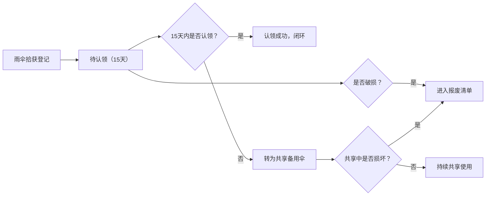

## 1. 产品概述

雨伞招领墙是面向校园场景的失物招领管理系统，专门解决雨天过后大量黑伞堆积在失物招领处、学生认领效率低下的问题。系统通过数字化登记、智能筛选、全生命周期管理，实现雨伞从拾获、待认领、共享到报废的全流程管控。

- 核心目标：降低雨伞认领的人工成本，提升认领匹配准确率，延长雨伞使用寿命
- 目标用户：在校学生（认领人）、物业/学生会工作人员（登记员、管理员）
- 产品价值：将传统"翻找式"认领升级为"搜索+匹配"模式，同时通过共享伞机制充分利用无人认领资源

## 2. 核心功能

### 2.1 用户角色

| 角色 | 登录方式 | 核心权限 |
|------|----------|----------|
| 普通用户（学生） | 无需登录 | 浏览雨伞列表、按条件筛选、提交认领申请 |
| 登记员 | 管理员账号登录 | 雨伞信息登记、照片上传、确认认领、标记破损 |
| 管理员 | 管理员账号登录 | 拥有登记员全部权限 + 查看统计看板、管理共享伞、查看报废清单、批量操作 |

### 2.2 功能模块

1. **雨伞登记页**：基础信息录入、照片上传（伞面/伞柄）、存放位置分配
2. **雨伞列表页**：多维度筛选（颜色/地点/特征/日期）、卡片式展示、认领入口
3. **认领申请页**：身份验证（班级/手机号后四位）、归属证明描述提交
4. **管理员首页**：数据统计看板、待认领数量、疑似重复提醒、即将到期预警、楼栋拾获分布
5. **共享伞管理页**：超期雨伞转共享、共享伞借还登记
6. **报废清单页**：破损雨伞记录、报废原因登记

### 2.3 页面详情

| 页面名称 | 模块名称 | 功能描述 |
|---------|---------|----------|
| 雨伞登记页 | 基础信息表单 | 颜色选择器、品牌输入、拾到地点（楼栋+区域）、拾到时间、存放格编号 |
| 雨伞登记页 | 照片上传区 | 伞面照片、伞柄照片上传，支持拖拽和预览 |
| 雨伞登记页 | 特征描述 | 伞面特征标签（花纹、图案、logo等）、备注信息 |
| 雨伞列表页 | 筛选区 | 颜色筛选、地点筛选、日期范围、特征关键词搜索 |
| 雨伞列表页 | 雨伞卡片 | 缩略图、颜色标签、拾到地点、拾到时间、状态标签 |
| 雨伞列表页 | 认领申请 | 点击认领按钮弹出申请表单 |
| 认领申请页 | 身份验证 | 班级输入、手机号后四位输入 |
| 认领申请页 | 归属证明 | 文字描述框，提示填写雨伞独有特征 |
| 管理员首页 | 统计卡片 | 待认领总数、今日新增、共享伞数量、报废数量 |
| 管理员首页 | 疑似重复 | 颜色+地点+特征高度相似的雨伞自动聚类提醒 |
| 管理员首页 | 即将到期 | 距离保管期限不足3天的雨伞列表 |
| 管理员首页 | 楼栋分布 | 柱状图展示各楼栋拾获雨伞数量 |
| 共享伞管理页 | 超期列表 | 超过15天保管期的雨伞，支持批量转共享 |
| 共享伞管理页 | 借还登记 | 共享伞借出/归还记录 |
| 报废清单页 | 破损记录 | 破损雨伞列表，含破损原因、处理状态 |

## 3. 核心流程

### 拾获登记流程
拾获人/登记员进入登记页 → 填写雨伞基础信息 → 上传伞面和伞柄照片 → 选择存放格 → 提交登记 → 雨伞进入待认领状态

### 认领匹配流程
学生进入雨伞列表 → 按颜色/地点/日期筛选 → 浏览雨伞卡片 → 找到目标雨伞 → 提交认领申请（班级+手机号后四位+归属描述） → 管理员审核 → 匹配成功 → 领取雨伞

### 生命周期流转

### 管理员审核流程
管理员查看待认领申请 → 核对归属描述与雨伞特征 → 确认匹配 → 通知认领人取伞 → 更新状态为已认领

## 4. 用户界面设计

### 4.1 设计风格

**设计主题：清新校园风 + 雨天气氛**
- 主色调：雨后蓝（#4A90D9）- 代表雨天、清爽、信任
- 辅助色：活力橙（#FF8C42）- 用于按钮、提醒、重要操作
- 中性色：浅灰蓝背景（#F5F8FC）、白色卡片、深灰文字
- 强调色：薄荷绿（#3ECF8E）表示正常状态，珊瑚红（#FF6B6B）表示警告/到期

**视觉元素：**
- 雨滴形状的装饰元素、雨伞图标作为视觉符号
- 卡片式布局，带柔和阴影和圆角
- 微交互动画：悬停上浮、筛选器展开、照片上传动效
- 背景：细微的水波纹纹理或雨滴点阵图案

**字体选择：**
- 标题字体：ZCOOL XiaoWei（站酷小薇）- 温暖人文的手写体，体现校园温度
- 正文字体：PingFang SC - 清晰易读的系统无衬线字体

**按钮风格：**
- 主按钮：圆角 12px，悬停上浮 + 阴影加深
- 次按钮：描边样式，悬停填充背景色
- 图标按钮：圆形，悬停旋转效果

### 4.2 页面设计概述

| 页面名称 | 模块名称 | UI 元素 |
|---------|---------|---------|
| 雨伞列表页 | 顶部导航 | Logo、页面标题、管理员入口、天气图标 |
| 雨伞列表页 | 筛选栏 | 横向排列的颜色标签、地点下拉、日期选择器、搜索框 |
| 雨伞列表页 | 瀑布流卡片 | 雨伞照片缩略图、颜色圆点标签、地点小图标、时间、状态角标 |
| 雨伞列表页 | 认领弹窗 | 半透明遮罩、表单卡片、输入框动画、提交按钮 |
| 雨伞登记页 | 表单布局 | 左侧表单、右侧照片预览区、分步骤进度条 |
| 雨伞登记页 | 上传区域 | 虚线边框、雨伞占位图标、拖拽反馈动画 |
| 管理员首页 | 统计看板 | 大数字卡片、趋势箭头、图标化指标 |
| 管理员首页 | 疑似重复区 | 相似雨伞并排对比、合并/忽略操作按钮 |
| 管理员首页 | 楼栋分布 | 横向柱状图，按数量排序，柱形渐变色 |

### 4.3 响应式设计

- **设计原则**：Desktop-first，移动端自适应
- **断点设计**：
  - 桌面端（≥1280px）：4列卡片网格，侧边筛选栏
  - 平板端（768px-1279px）：2-3列卡片网格，顶部筛选栏
  - 移动端（<768px）：单列卡片列表，筛选器改为下拉折叠
- **触摸优化**：移动端按钮最小尺寸 44x44px，表单输入框适配软键盘弹出

### 4.4 动效设计

- **页面加载**：卡片从下往上逐个淡入，错开 100ms 延迟
- **筛选交互**：选择筛选条件时，卡片以缩放+透明度动画重排
- **照片上传**：上传成功后照片缩略图从中心弹出，带成功勾选动画
- **状态变更**：雨伞状态变更时，卡片背景色过渡闪烁
- **认领成功**：绿色对勾动画 + 彩色纸屑飘落效果
