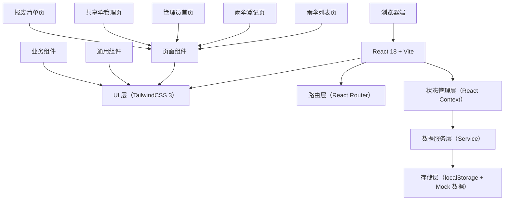
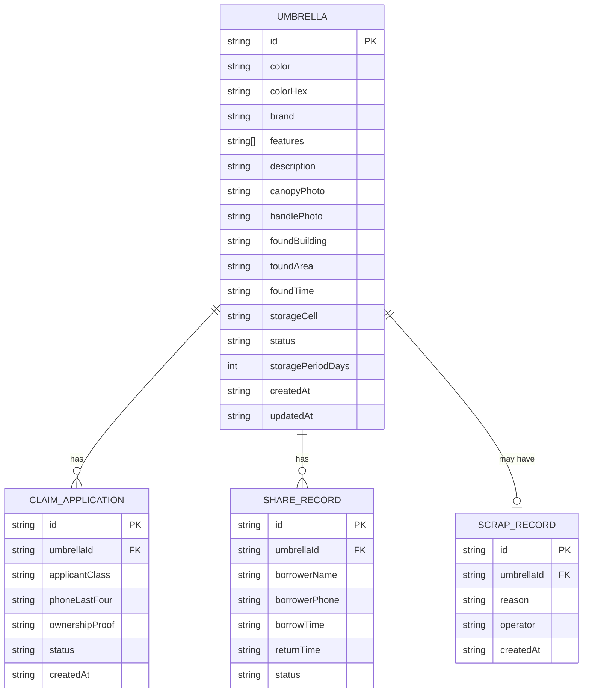

## 1. 架构设计

本项目采用纯前端架构，数据通过 localStorage 持久化，使用 Mock 数据模拟后端接口，便于快速开发和演示。



## 2. 技术描述

### 技术栈选型
- **前端框架**：React 18 + TypeScript
- **构建工具**：Vite 5
- **样式方案**：TailwindCSS 3.4
- **路由管理**：React Router DOM 6
- **图标库**：Lucide React
- **图表库**：Recharts
- **数据存储**：localStorage + TypeScript 类型约束
- **图片处理**：Base64 编码存储（演示用）

### 项目初始化
- 使用 `npm create vite@latest` 初始化 React + TypeScript 项目
- 安装 TailwindCSS 3 及相关依赖
- 配置路径别名 `@` 指向 `src` 目录
- 配置 ESLint + Prettier 代码规范

## 3. 路由定义

| 路由路径 | 页面名称 | 权限要求 | 说明 |
|---------|---------|----------|------|
| `/` | 雨伞列表页 | 公开 | 浏览雨伞、筛选、申请认领 |
| `/register` | 雨伞登记页 | 管理员/登记员 | 雨伞信息录入、照片上传 |
| `/admin` | 管理员首页 | 管理员 | 数据统计看板、待办提醒 |
| `/admin/share` | 共享伞管理页 | 管理员 | 超期伞转共享、借还登记 |
| `/admin/scrap` | 报废清单页 | 管理员 | 破损伞记录、报废处理 |
| `/admin/login` | 管理员登录页 | 公开 | 管理员身份验证 |

## 4. API 定义（Mock 接口）

### 4.1 雨伞相关接口

```typescript
// 雨伞数据模型
interface Umbrella {
  id: string;
  color: string;
  colorHex: string;
  brand: string;
  features: string[];
  description: string;
  canopyPhoto: string; // base64
  handlePhoto: string; // base64
  foundLocation: {
    building: string;
    area: string;
  };
  foundTime: string; // ISO date
  storageCell: string;
  status: 'pending' | 'claimed' | 'shared' | 'scrapped';
  storagePeriodDays: number; // 保管期限，默认15天
  createdAt: string;
  updatedAt: string;
}

// 认领申请模型
interface ClaimApplication {
  id: string;
  umbrellaId: string;
  applicantClass: string;
  phoneLastFour: string;
  ownershipProof: string;
  status: 'pending' | 'approved' | 'rejected';
  createdAt: string;
}

// 共享伞借还记录
interface ShareRecord {
  id: string;
  umbrellaId: string;
  borrowerName: string;
  borrowerPhone: string;
  borrowTime: string;
  returnTime: string | null;
  status: 'borrowed' | 'returned';
}

// 报废记录
interface ScrapRecord {
  id: string;
  umbrellaId: string;
  reason: string;
  operator: string;
  createdAt: string;
}
```

### 4.2 Mock 服务方法

| 方法名 | 参数 | 返回值 | 说明 |
|-------|------|--------|------|
| `getUmbrellas(filters?)` | filters: 筛选条件 | `Umbrella[]` | 获取雨伞列表，支持筛选 |
| `getUmbrellaById(id)` | id: string | `Umbrella \| null` | 获取单把雨伞详情 |
| `createUmbrella(data)` | data: 雨伞表单数据 | `Umbrella` | 登记新雨伞 |
| `updateUmbrellaStatus(id, status)` | id, status | `Umbrella` | 更新雨伞状态 |
| `createClaimApplication(data)` | data: 认领申请 | `ClaimApplication` | 提交认领申请 |
| `getClaimApplications(umbrellaId?)` | umbrellaId? | `ClaimApplication[]` | 获取认领申请列表 |
| `approveClaim(applicationId)` | applicationId | `void` | 审核通过认领 |
| `rejectClaim(applicationId, reason)` | applicationId, reason | `void` | 驳回认领申请 |
| `transferToShared(umbrellaId)` | umbrellaId | `Umbrella` | 转为共享伞 |
| `createShareRecord(data)` | data: 借用数据 | `ShareRecord` | 登记借用 |
| `returnUmbrella(recordId)` | recordId | `ShareRecord` | 登记归还 |
| `scrapUmbrella(umbrellaId, reason)` | umbrellaId, reason | `ScrapRecord` | 报废雨伞 |
| `getDashboardStats()` | - | Dashboard 统计数据 | 获取管理员首页统计 |
| `getSimilarUmbrellas()` | - | 相似雨伞分组 | 获取疑似重复的雨伞 |
| `getExpiringUmbrellas(days?)` | days: 预警天数 | `Umbrella[]` | 获取即将到期的雨伞 |
| `getBuildingStats()` | - | 各楼栋统计数据 | 获取楼栋拾获分布 |

## 5. 数据模型

### 5.1 ER 图



### 5.2 Mock 数据初始化

```typescript
// 初始化 Mock 数据（首次访问时注入 localStorage）
const MOCK_UMBRELLAS: Umbrella[] = [
  {
    id: 'umb-001',
    color: '黑色',
    colorHex: '#1a1a1a',
    brand: '天堂伞',
    features: ['纯色', '长柄', '弯钩'],
    description: '伞面有轻微磨损',
    canopyPhoto: 'data:image/svg+xml,...', // 占位 SVG
    handlePhoto: 'data:image/svg+xml,...',
    foundLocation: { building: '教学楼A', area: '一楼大厅' },
    foundTime: '2024-06-15T10:30:00Z',
    storageCell: 'A-01',
    status: 'pending',
    storagePeriodDays: 15,
    createdAt: '2024-06-15T10:35:00Z',
    updatedAt: '2024-06-15T10:35:00Z',
  },
  // 更多模拟数据...
];
```

## 6. 目录结构

```
src/
├── assets/               # 静态资源
│   ├── fonts/           # 自定义字体
│   └── images/          # 图片资源
├── components/          # 通用组件
│   ├── ui/             # 基础 UI 组件（Button, Modal, Input 等）
│   ├── UmbrellaCard.tsx
│   ├── UmbrellaFilter.tsx
│   ├── PhotoUploader.tsx
│   ├── ColorPicker.tsx
│   ├── StatsCard.tsx
│   └── BuildingChart.tsx
├── context/             # 状态管理
│   ├── UmbrellaContext.tsx
│   └── AuthContext.tsx
├── pages/               # 页面组件
│   ├── UmbrellaList.tsx
│   ├── UmbrellaRegister.tsx
│   ├── admin/
│   │   ├── AdminDashboard.tsx
│   │   ├── ShareManagement.tsx
│   │   ├── ScrapList.tsx
│   │   └── Login.tsx
│   └── Layout.tsx
├── services/            # 数据服务层
│   ├── umbrellaService.ts
│   ├── claimService.ts
│   ├── shareService.ts
│   └── storage.ts       # localStorage 封装
├── types/               # TypeScript 类型定义
│   └── index.ts
├── utils/               # 工具函数
│   ├── dateUtils.ts
│   ├── mockData.ts
│   └── imageUtils.ts
├── App.tsx
├── main.tsx
└── index.css
```

## 7. 核心技术实现要点

### 7.1 图片存储方案
- 演示阶段使用 Base64 编码存储图片到 localStorage
- 限制图片大小（最大 500KB），使用 Canvas 压缩
- 提供默认雨伞 SVG 占位图

### 7.2 疑似重复算法
- 基于颜色 + 品牌 + 拾到地点 + 特征标签的相似度计算
- 使用简单的加权打分机制，相似度 > 80% 标记为疑似重复

### 7.3 到期提醒
- 根据 `foundTime` + `storagePeriodDays` 计算到期日期
- 距离到期 < 3 天标记为"即将到期"，显示红色警告

### 7.4 响应式布局
- TailwindCSS 断点：sm/md/lg/xl
- 网格布局自适应：`grid-cols-1 md:grid-cols-2 lg:grid-cols-3 xl:grid-cols-4`

### 7.5 动画实现
- 使用 TailwindCSS 的 transition 类实现基础动效
- 使用 Framer Motion（可选）实现复杂的列表动画和进入效果
- CSS 实现雨滴背景动画
