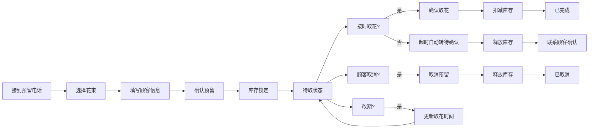

## 1. 产品概述
鲜花预留看板系统，帮助花店管理花束预留业务，解决电话预留容易忘、库存占压、超时未取等问题。
- 目标用户：花店店员和老板
- 核心价值：提升预留管理效率，减少库存浪费，提供数据决策支持

## 2. 核心功能

### 2.1 用户角色
| 角色 | 核心权限 |
|------|----------|
| 店员 | 花束浏览、创建预留、处理取花/取消/改期 |
| 老板 | 全部店员权限 + 数据看板统计 + 花束管理 |

### 2.2 功能模块
1. **花束看板**：花束卡片列表，展示花材、颜色、价格、剩余数量、保鲜位置、照片
2. **预留管理**：创建预留、处理取花、取消预留、改期操作
3. **操作记录**：所有预留相关操作的完整日志
4. **老板看板**：今日取花、快过保鲜期、预留转化率、取消款式排行

### 2.3 页面详情
| 页面名称 | 模块名称 | 功能描述 |
|-----------|-------------|---------------------|
| 花束看板页 | 花束卡片列表 | 网格布局展示所有花束，支持按分类筛选和搜索 |
| 花束看板页 | 花束详情卡 | 显示花材、颜色、价格、库存、保鲜位置、照片 |
| 花束看板页 | 快速预留入口 | 点击花束卡快速创建预留订单 |
| 预留管理页 | 预留列表 | 显示所有预留订单，按状态分类（待取/待确认/已完成/已取消） |
| 预留管理页 | 预留详情 | 顾客信息、取花时间、定金、贺卡、特殊包装要求 |
| 预留管理页 | 操作按钮 | 取花确认、取消、改期 |
| 操作记录页 | 记录列表 | 所有操作的时间线展示，支持筛选 |
| 老板看板页 | 今日取花 | 当天需要取的花束列表 |
| 老板看板页 | 保鲜预警 | 快过保鲜期的花束提醒 |
| 老板看板页 | 转化统计 | 预留转成交比例数据 |
| 老板看板页 | 取消排行 | 被取消最多的款式排名 |

## 3. 核心流程

### 3.1 预留创建流程
店员接到电话 → 在花束看板找到对应花束 → 点击预留 → 填写顾客信息 → 确认提交 → 库存锁定 → 生成预留记录

### 3.2 取花流程
顾客到店 → 找到预留订单 → 确认取花 → 扣减库存 → 更新状态为已完成 → 生成操作记录

### 3.3 超时自动处理
系统定时检查 → 取花时间已过且未取 → 状态自动转为待确认 → 释放库存占用 → 生成操作记录

### 3.4 取消/改期流程
找到预留订单 → 点击取消/改期 → 填写原因 → 确认 → 释放/保留库存 → 生成操作记录

## 4. 用户界面设计

### 4.1 设计风格
- **主色调**：豆沙粉 #E8A598 + 墨绿 #2D4A3E，营造温馨自然的花店氛围
- **辅助色**：奶白 #FAF6F2 背景，暖金 #D4A574 点缀
- **卡片风格**：圆角卡片 + 柔和阴影 + 轻微悬浮效果
- **字体**：标题用优雅衬线字体（如 Noto Serif SC），正文用清晰无衬线（如 Noto Sans SC）
- **布局**：左侧导航 + 右侧内容区，卡片式网格布局
- **图标风格**：线性图标，柔和圆角，配品牌色

### 4.2 页面设计概览
| 页面名称 | 模块名称 | UI 元素 |
|-----------|-------------|-------------|
| 花束看板 | 花束卡片 | 图片顶部展示 + 信息底部排列 + 预留按钮悬浮 |
| 花束看板 | 筛选栏 | 分类标签 + 搜索框 + 排序下拉 |
| 预留管理 | 状态标签 | 彩色状态徽章 + 时间倒计时 |
| 预留管理 | 预留卡片 | 顾客信息区 + 花束信息区 + 操作按钮区 |
| 老板看板 | 统计卡片 | 大数字 + 趋势箭头 + 迷你图表 |
| 老板看板 | 预警列表 | 红色警告图标 + 倒计时天数 |
| 操作记录 | 时间线 | 竖线连接 + 操作类型图标 + 时间戳 |

### 4.3 响应式
- 桌面端：侧边导航 + 网格布局
- 平板端：顶部导航 + 两列网格
- 移动端：底部 Tab 导航 + 单列列表
- 触屏优化：加大点击区域，支持滑动操作

### 4.4 动效设计
- 页面加载：卡片淡入上移，错落出现
- 悬停效果：卡片轻微上浮，阴影加深
- 状态变化：颜色渐变过渡，数字跳动动画
- 操作反馈：按钮按压效果，成功提示滑入
