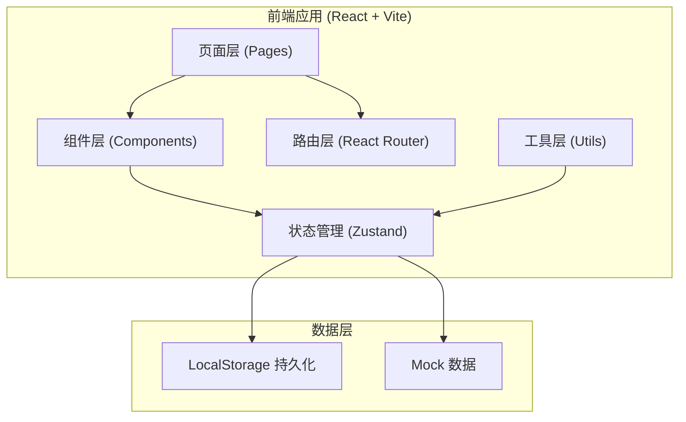
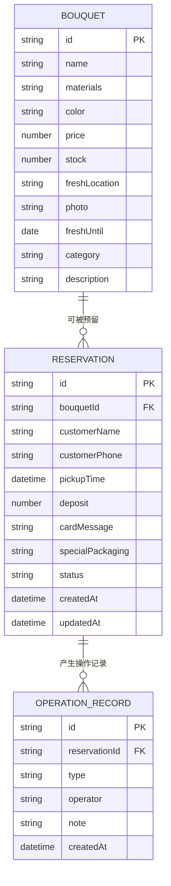

## 1. 架构设计



## 2. 技术栈说明

- **前端框架**：React@18 + TypeScript
- **构建工具**：Vite@5
- **样式方案**：TailwindCSS@3
- **状态管理**：Zustand
- **路由管理**：React Router v6
- **图标库**：Lucide React
- **数据持久化**：LocalStorage
- **图表**：Recharts

## 3. 路由定义

| 路由 | 页面名称 | 说明 |
|-------|---------|------|
| /dashboard | 老板看板 | 数据统计、今日取花、保鲜预警 |
| /bouquets | 花束看板 | 花束列表、筛选搜索、快速预留 |
| /reservations | 预留管理 | 预留订单列表、状态筛选、操作 |
| /records | 操作记录 | 操作日志时间线 |

## 4. 数据模型

### 4.1 数据模型 ER 图



### 4.2 类型定义

```typescript
// 花束
interface Bouquet {
  id: string;
  name: string;
  materials: string;
  color: string;
  price: number;
  stock: number;
  reservedCount: number;
  freshLocation: string;
  photo: string;
  freshUntil: string;
  category: string;
  description: string;
  createdAt: string;
}

// 预留状态
type ReservationStatus = 'pending' | 'to_confirm' | 'completed' | 'cancelled';

// 预留订单
interface Reservation {
  id: string;
  bouquetId: string;
  bouquetName: string;
  bouquetPhoto: string;
  customerName: string;
  customerPhone: string;
  pickupTime: string;
  deposit: number;
  cardMessage: string;
  specialPackaging: string;
  status: ReservationStatus;
  quantity: number;
  createdAt: string;
  updatedAt: string;
}

// 操作记录
interface OperationRecord {
  id: string;
  reservationId: string;
  type: 'create' | 'complete' | 'cancel' | 'reschedule' | 'timeout';
  operator: string;
  note: string;
  createdAt: string;
}

// 统计数据
interface DashboardStats {
  todayPickups: number;
  freshWarningCount: number;
  conversionRate: number;
  mostCancelledBouquets: { name: string; count: number }[];
}
```

## 5. 状态管理设计

### 5.1 Store 结构

```
appStore
├── bouquetStore
│   ├── bouquets: Bouquet[]
│   ├── addBouquet()
│   ├── updateBouquet()
│   ├── deleteBouquet()
│   └── getBouquetById()
├── reservationStore
│   ├── reservations: Reservation[]
│   ├── createReservation()
│   ├── completeReservation()
│   ├── cancelReservation()
│   ├── rescheduleReservation()
│   └── checkTimeoutReservations()
├── recordStore
│   ├── records: OperationRecord[]
│   └── addRecord()
└── dashboardStore
    ├── stats: DashboardStats
    └── computeStats()
```

### 5.2 业务逻辑

- **库存管理**：创建预留时增加 reservedCount，取消/超时时减少
- **超时检查**：应用启动和页面切换时检查超时预留，自动转为待确认状态
- **操作记录**：所有状态变更自动生成操作日志

## 6. 组件结构

```
src/
├── components/
│   ├── layout/
│   │   ├── Sidebar.tsx
│   │   └── PageHeader.tsx
│   ├── bouquet/
│   │   ├── BouquetCard.tsx
│   │   ├── BouquetGrid.tsx
│   │   └── ReserveModal.tsx
│   ├── reservation/
│   │   ├── ReservationCard.tsx
│   │   ├── ReservationList.tsx
│   │   └── StatusBadge.tsx
│   ├── dashboard/
│   │   ├── StatCard.tsx
│   │   ├── TodayPickups.tsx
│   │   ├── FreshWarning.tsx
│   │   └── CancelledRanking.tsx
│   └── common/
│       ├── Modal.tsx
│       └── EmptyState.tsx
├── pages/
│   ├── Dashboard.tsx
│   ├── Bouquets.tsx
│   ├── Reservations.tsx
│   └── Records.tsx
├── store/
│   ├── bouquetStore.ts
│   ├── reservationStore.ts
│   └── recordStore.ts
├── types/
│   └── index.ts
├── utils/
│   ├── date.ts
│   └── mock.ts
├── App.tsx
└── main.tsx
```
